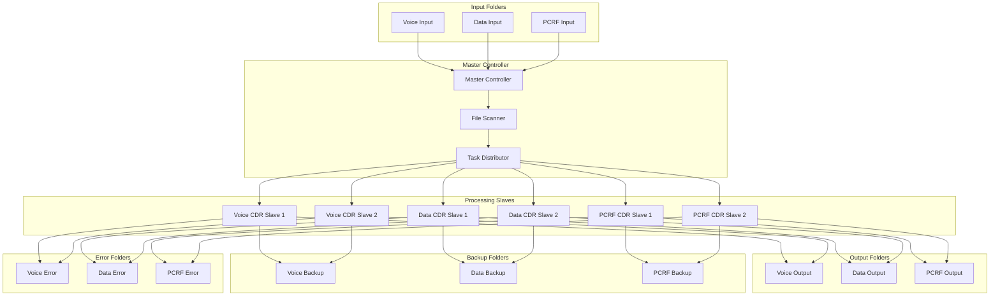
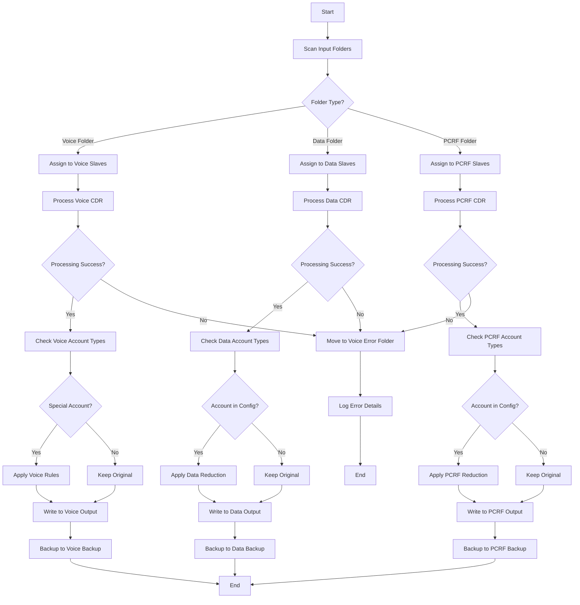
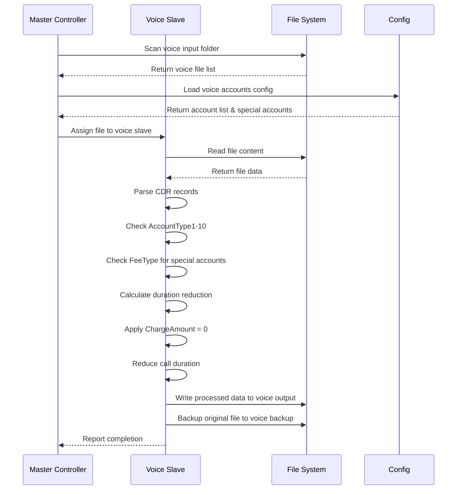
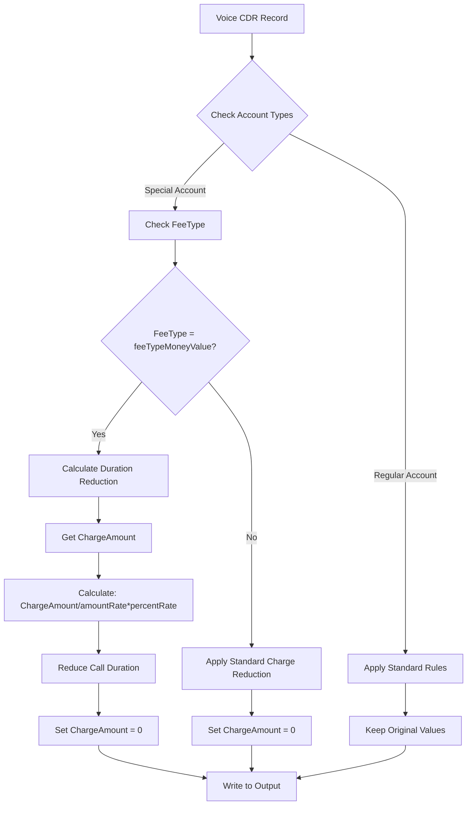
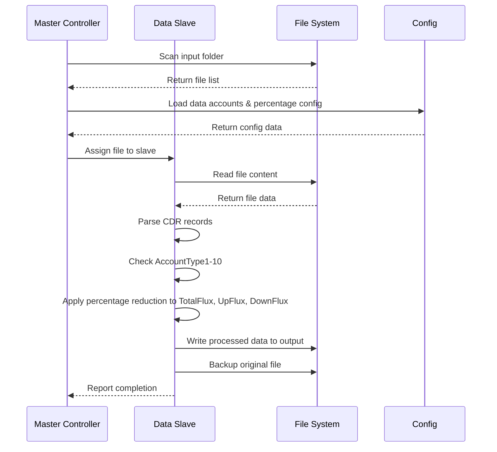
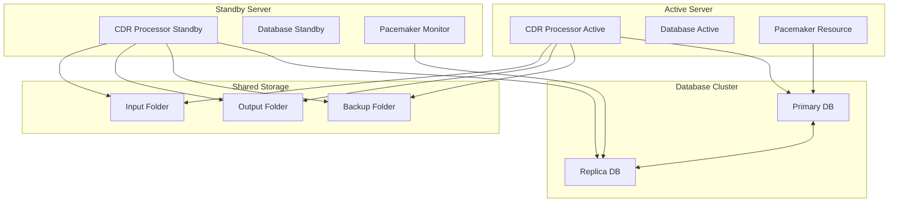
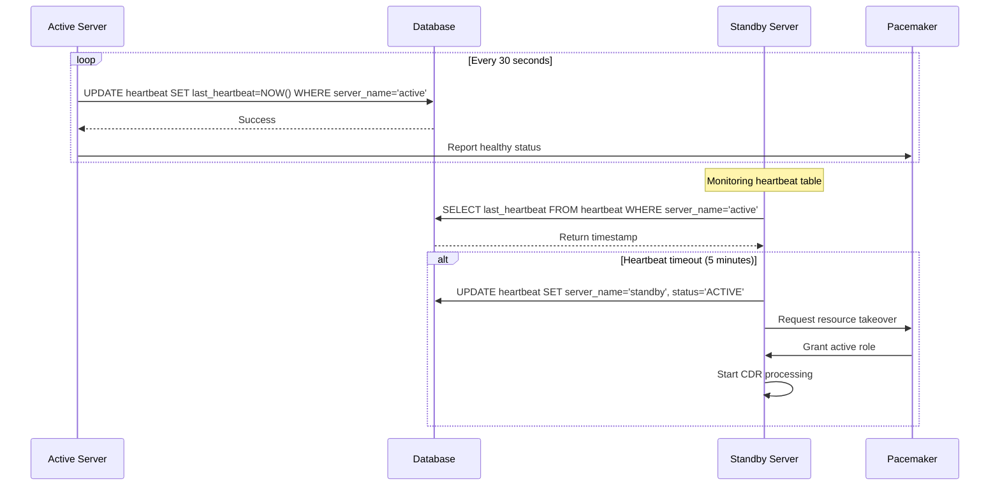
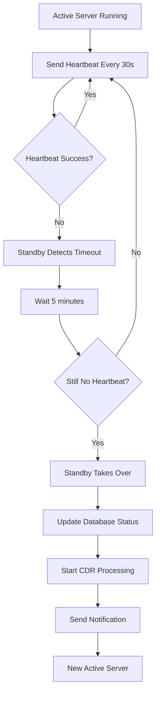

# Tài Liệu Thiết Kế Hệ Thống Xử Lý Dữ Liệu CDR

## 1. Tổng Quan Hệ Thống

### 1.1 Mục Đích
Hệ thống xử lý dữ liệu CDR (Call Detail Record) được thiết kế để xử lý các file text chứa dữ liệu cuộc gọi và dữ liệu data, thực hiện các thao tác chỉnh sửa hoặc xóa các trường thông tin theo cấu hình.

### 1.2 Phạm Vi
- Xử lý dữ liệu Voice CDR: Giảm trừ ChargeAmount về 0 và giảm thời gian cuộc gọi cho các tài khoản đặc biệt
- Xử lý dữ liệu Data CDR: Giảm trừ TotalFlux, UpFlux, DownFlux theo tỷ lệ phần trăm
- Xử lý dữ liệu PCRF CDR: Giảm trừ TotalFlux, UpFlux, DownFlux theo tỷ lệ phần trăm
- Kiến trúc Master-Slave để xử lý song song
- Cấu hình linh hoạt cho input, output, backup folders
- Cấu hình riêng biệt cho từng loại CDR (Voice, Data, PCRF)

## 2. Kiến Trúc Hệ Thống

### 2.1 Kiến Trúc Tổng Thể



### 2.2 Luồng Xử Lý Chính



## 3. Thiết Kế Chi Tiết

### 3.1 Cấu Trúc Dự Án Java

```
src/
├── main/
│   ├── java/
│   │   ├── com/
│   │   │   └── cdr/
│   │   │       ├── processor/
│   │   │       │   ├── MasterController.java
│   │   │       │   ├── SlaveProcessor.java
│   │   │       │   ├── VoiceCDRProcessor.java
│   │   │       │   └── DataCDRProcessor.java
│   │   │       ├── config/
│   │   │       │   ├── SystemConfig.java
│   │   │       │   └── CDRConfig.java
│   │   │       ├── model/
│   │   │       │   ├── CDRRecord.java
│   │   │       │   ├── VoiceCDR.java
│   │   │       │   └── DataCDR.java
│   │   │       ├── util/
│   │   │       │   ├── FileUtils.java
│   │   │       │   └── ConfigUtils.java
│   │   │       └── CDRProcessorMain.java
│   │   └── resources/
│   │       ├── application.properties
│   │       └── cdr-config.properties
├── wrapper/
│   ├── wrapper.jar
│   ├── wrapper.conf
│   ├── wrapper-license.conf
│   └── lib/
│       └── wrapper-*.jar
└── target/
    └── cdr-processor.jar
```

### 3.2 Cấu Hình Hệ Thống

#### 3.2.1 File application.properties
```properties
# Folder Configuration
cdr.input.folder=/data/input
cdr.output.folder=/data/output
cdr.backup.folder=/data/backup
cdr.error.folder=/data/error

# Voice CDR Folders
cdr.voice.input.folder=/data/input/voice
cdr.voice.output.folder=/data/output/voice
cdr.voice.backup.folder=/data/backup/voice
cdr.voice.error.folder=/data/error/voice

# Data CDR Folders
cdr.data.input.folder=/data/input/data
cdr.data.output.folder=/data/output/data
cdr.data.backup.folder=/data/backup/data
cdr.data.error.folder=/data/error/data

# PCRF CDR Folders
cdr.pcrf.input.folder=/data/input/pcrf
cdr.pcrf.output.folder=/data/output/pcrf
cdr.pcrf.backup.folder=/data/backup/pcrf
cdr.pcrf.error.folder=/data/error/pcrf

# Slave Configuration
cdr.voice.slaves=2
cdr.data.slaves=2
cdr.pcrf.slaves=2

# Processing Configuration
cdr.batch.size=1000
cdr.thread.pool.size=10
cdr.processing.interval=60000

# High Availability Configuration
cdr.server.name=${HOSTNAME:cdr-server-01}
cdr.heartbeat.interval=30000
cdr.heartbeat.timeout=300000
cdr.heartbeat.check.interval=60000

# Database Configuration
cdr.database.url=jdbc:mysql://localhost:3306/cdr_db
cdr.database.username=cdr_user
cdr.database.password=${DB_PASSWORD}
cdr.database.driver=com.mysql.cj.jdbc.Driver
cdr.database.pool.size=10
cdr.database.pool.max=20

# Logging Configuration
cdr.logging.level=INFO
cdr.logging.file=/var/log/cdr-processor/cdr-processor.log
cdr.logging.max.size=100MB
cdr.logging.max.files=10
```

#### 3.2.2 File voice-config.properties
```properties
# Voice CDR Charge Configuration
ocsChargeCount=10
AccountType1=76
FeeType1=77
ChargeAmount1=78
CurrentAcctAmount1=79
AccountType2=80
FeeType2=81
ChargeAmount2=82
CurrentAcctAmount2=83
AccountType3=84
FeeType3=85
ChargeAmount3=86
CurrentAcctAmount3=87
AccountType4=88
FeeType4=89
ChargeAmount4=90
CurrentAcctAmount4=91
AccountType5=92
FeeType5=93
ChargeAmount5=94
CurrentAcctAmount5=95
AccountType6=96
FeeType6=97
ChargeAmount6=98
CurrentAcctAmount6=99
AccountType7=100
FeeType7=101
ChargeAmount7=102
CurrentAcctAmount7=103
AccountType8=104
FeeType8=105
ChargeAmount8=106
CurrentAcctAmount8=107
AccountType9=108
FeeType9=109
ChargeAmount9=110
CurrentAcctAmount9=111
AccountType10=112
FeeType10=113
ChargeAmount10=114
CurrentAcctAmount10=115

# Voice CDR Fee Type Money Value Configuration
feeTypeMoneyValue=2
amountRate=0.5
callDurationPosition=22

# Voice CDR Special Account Duration Reduction
cdr.voice.special.accounts=15403,15404,15405
```

#### 3.2.3 File data-config.properties
```properties
# Data CDR Processing Configuration
cdr.data.accounts=DATA001,DATA002
cdr.data.reduction.percentage=50.0
cdr.data.fields=TotalFlux,UpFlux,DownFlux

# Data CDR White List Configuration
cdr.data.whitelist.accounts=WHITE001,WHITE002,WHITE003
cdr.data.whitelist.enabled=true

# Data CDR Field Positions
dataTotalFluxPosition=17
dataUpFluxPosition=18
dataDownFluxPosition=19
dataTotalChargeFluxPosition=58

# Data Charge Configuration
dataChargeCount=5
dataAccountType1=76
dataFeeType1=77
dataChargeAmount1=78
dataCurrentAcctAmount1=79
dataAccountType2=80
dataFeeType2=81
dataChargeAmount2=82
dataCurrentAcctAmount2=83
dataAccountType3=84
dataFeeType3=85
dataChargeAmount3=86
dataCurrentAcctAmount3=87
dataAccountType4=88
dataFeeType4=89
dataChargeAmount4=90
dataCurrentAcctAmount4=91
dataAccountType5=92
dataFeeType5=93
dataChargeAmount5=94
dataCurrentAcctAmount5=95

# Special Data Charge Configuration
dataSpecialChargeCount=3
dataSpecialAccountType1=15403
dataDiscountRate1=100
dataSpecialAccountType2=15404
dataDiscountRate2=100
dataSpecialAccountType3=15405
dataDiscountRate3=100
```

#### 3.2.4 File pcrf-config.properties
```properties
# PCRF CDR Processing Configuration
cdr.pcrf.accounts=PCRF001,PCRF002,PCRF003
cdr.pcrf.reduction.percentage=30.0

# PCRF CDR Field Positions
pcrfTotalFluxPosition=15
pcrfUpFluxPosition=16
pcrfDownFluxPosition=17
pcrfTotalChargeFluxPosition=18

# PCRF Charge Configuration
pcrfChargeCount=5
pcrfAccountType1=76
pcrfFeeType1=77
pcrfChargeAmount1=78
pcrfCurrentAcctAmount1=79
pcrfAccountType2=80
pcrfFeeType2=81
pcrfChargeAmount2=82
pcrfCurrentAcctAmount2=83
pcrfAccountType3=84
pcrfFeeType3=85
pcrfChargeAmount3=86
pcrfCurrentAcctAmount3=87
pcrfAccountType4=88
pcrfFeeType4=89
pcrfChargeAmount4=90
pcrfCurrentAcctAmount4=91
pcrfAccountType5=92
pcrfFeeType5=93
pcrfChargeAmount5=94
pcrfCurrentAcctAmount5=95

# Special PCRF Charge Configuration
pcrfSpecialChargeCount=3
pcrfSpecialAccountType1=15403
pcrfDiscountRate1=100
pcrfSpecialAccountType2=15404
pcrfDiscountRate2=100
pcrfSpecialAccountType3=15405
pcrfDiscountRate3=100
```

### 3.3 Luồng Xử Lý Chi Tiết

#### 3.3.1 Xử Lý Voice CDR với Duration Reduction

**Mô tả quy trình xử lý Voice CDR:**
Mô tả các trường trong file cdr nằm trong file Documents\MobilePostpaid_CDR description_vOCS3.0 Movitel.csv
Ví dụ các file cdr nằm trong thư mục Documents\CDR\voice

1. **Quét thư mục input voice**: Hệ thống quét thư mục `/data/input/voice` để tìm các file CDR voice
2. **Đọc cấu hình**: Load cấu hình từ `voice-config.properties` bao gồm:
   - Danh sách tài khoản thường: `cdr.voice.accounts`
   - Danh sách tài khoản đặc biệt: `specialAccountType1-3` (15403, 15404, 15405)
   - Tỷ lệ giảm giá: `discountRate1-3` (100%)
   - Vị trí các trường: `AccountType1-10`, `FeeType1-10`, `ChargeAmount1-10`
   - Cấu hình giảm thời gian: `feeTypeMoneyValue`, `amountRate`, `callDurationPosition`

3. **Phân tích từng bản ghi CDR**:
   - **Kiểm tra AccountType1-10**: Xác định loại tài khoản trong các vị trí 76, 80, 84, 88, 92, 96, 100, 104, 108, 112
   - **Kiểm tra FeeType1-10**: Xác định loại phí (tiến hoặc lưu lượng) trong các vị trí 77, 81, 85, 89, 93, 97, 101, 105, 109, 113
   - **Kiểm tra ChargeAmount1-10**: Lấy lưu lượng hoặc số tiền phí trong các vị trí 78, 82, 86, 90, 94, 98, 102, 106, 110, 114
   - **Kiểm tra CurrentAcctAmount1-10**: Lấy lưu lượng hoặc số tiền phí trong các vị trí 79, 83, 87, 91, 95, 99, 103, 107, 111, 115

4. **Xử lý tài khoản đặc biệt** (15403, 15404, 15405):
   - **Điều kiện**: AccountType thuộc danh sách đặc biệt
   - **Tính toán giảm thời gian**: Nếu loại tài khoản là lưu lượng thì thời gian là `ChargeAmount` hoặc nếu là tiền thì tính theo rate thời gian là `(ChargeAmount / amountRate)`
   - **Giảm thời gian cuộc gọi**: Trường `CallDuration` tại vị trí 22
   - **Đặt phí về 0**: `ChargeAmount = 0` cho tài khoản đặc biệt
   - **Bù lại chi phí**: `CurrentAcctAmount = CurrentAcctAmount + oldChargeAmount`

6. **Ghi kết quả**:
   - **Output**: Ghi file đã xử lý vào `/data/output/voice`
   - **Backup**: Sao lưu file gốc vào `/data/backup/voice`
   - **Error**: Nếu lỗi, chuyển file vào `/data/error/voice`

**Các trường CDR được sử dụng và thay đổi:**

| Trường | Vị trí | Mô tả | Thay đổi |
|--------|--------|-------|----------|
| AccountType1-10 | 71, 75, 79, 83, 87, 91, 95, 99, 103, 107 | Loại tài khoản | Không thay đổi |
| FeeType1-10 | 72, 76, 80, 84, 88, 92, 96, 100, 104, 108 | Loại phí | Không thay đổi |
| ChargeAmount1-10 | 73, 77, 81, 85, 89, 93, 97, 101, 105, 109 | Số tiền phí | Đặt về 0 |
| CurrentAcctAmount1-10 |  79, 83, 87, 91, 95, 99, 103, 107, 111, 115 | Số tiền còn lại | Cộng lại số tiền ChargeAmount đã giảm trừ|
| CallDuration | 22 | Thời gian cuộc gọi | Giảm theo công thức tính toán |


**Công thức tính giảm thời gian:**
```
Giảm thời gian = nếu tài khoản là lưu lượng FeeType1-10 khác giá trị cấu hình   (ChargeAmount / amountRate)
Thời gian mới = Max(0, Thời gian cũ - Giảm thời gian)
```

**Ví dụ tính toán:**
- AccountType1 = 2408304 
- FeeType1 = 0 (loại lưu lượng)
- ChargeAmount1 = 25
- CurrentAcctAmount1 = 168
- CallDuration = 25
- amountRate = 0.5
- Giảm thời gian  = 25 giây
- call duration = 25 - 25 = 0
- ChargeAmount mới = 28 + 1 = 29

**Báo cáo xử lý Voice CDR:**

Hệ thống tự động tạo báo cáo chi tiết cho mỗi file Voice CDR được xử lý, bao gồm:

1. **Thông tin cuộc gọi**:
   - **Calling Number**: Số điện thoại người gọi (trường vị trí 4)
   - **Called Number**: Số điện thoại người nhận (trường vị trí 5)
   - **Start Time**: Thời gian bắt đầu cuộc gọi (trường vị trí 2)

2. **Thông tin thời gian**:
   - **Old Duration**: Thời gian cuộc gọi ban đầu (trường vị trí 22)
   - **New Duration**: Thời gian cuộc gọi sau khi giảm
   - **Duration Reduction**: Số giây đã giảm
   - **Reduction Percentage**: Tỷ lệ phần trăm giảm thời gian

3. **Thông tin tài khoản**:
   - **Account Type**: Loại tài khoản được xử lý
   - **Fee Type**: Loại amount tiền hoặc lưu lượng
   - **Charge Amount**: Số tiền hoặc lưu lượng
   - **Current Acct Amount**: Số tiền hoặc lưu lượng còn lại

4. **Định dạng báo cáo**:
```
CallID|Calling|Called|StartTime|OldDuration|NewDuration|DurationReduction|AcctType1|FreeType1|OldChargeAmt1|NewChargeAmt1|OldCurAcctAmt1|NewCurAcctAmt1|...|AcctType10|FreeType10|OldChargeAmt10|NewChargeAmt10|OldCurAcctAmt10|NewCurAcctAmt10
20241201143022001|+258841234567|+258842345678|2024-12-01 14:30:22|3000|1000|2000|2408304|0|25|0|168|143|...|0|0|0|0|0|0
20241201143022002|+258841234568|+258842345679|2024-12-01 14:31:15|2500|800|1700|2408305|0|20|0|160|140|...|0|0|0|0|0|0
20241201143022003|+258841234569|+258842345680|2024-12-01 14:32:08|1800|1800|0|2408306|0|30|30|150|150|...|0|0|0|0|0|0
```

5. **Lưu trữ báo cáo**:
   - **Báo cáo tổng hợp**: `/data/reports/voice_processing_report_YYYYMMDD.txt`
   - **Báo cáo chi tiết**: `/data/reports/voice_detailed_report_YYYYMMDD_HHMMSS.txt`
   - **Báo cáo pipe-separated**: `/data/reports/voice_pipe_report_YYYYMMDD_HHMMSS.txt`
   - **Báo cáo lỗi**: `/data/reports/voice_error_report_YYYYMMDD.txt`

6. **Thống kê báo cáo**:
   - Tổng số bản ghi được xử lý
   - Số bản ghi tài khoản đặc biệt
   - Tổng thời gian giảm (giây)
   - Tỷ lệ giảm thời gian trung bình
   - Số tiền phí đã giảm

**Implementation của Voice CDR Reporting:**

```java
public class VoiceCDRReporter {
    
    private static final Logger log = LoggerFactory.getLogger(VoiceCDRReporter.class);
    private final String reportFolder;
    private final Map<String, Object> processingStats = new HashMap<>();
    private final List<VoiceCDRRecord> processedRecords = new ArrayList<>();
    
    public VoiceCDRReporter(SystemConfig config) {
        this.reportFolder = config.getReportFolder();
    }
    
    public void recordProcessedCall(VoiceCDR record, long oldDuration, long newDuration, 
                                   String accountType, String processingType) {
        VoiceCDRRecord reportRecord = new VoiceCDRRecord();
        reportRecord.setCallId(record.getCallId());
        reportRecord.setCallingNumber(record.getCallingNumber());
        reportRecord.setCalledNumber(record.getCalledNumber());
        reportRecord.setOldDuration(oldDuration);
        reportRecord.setNewDuration(newDuration);
        reportRecord.setDurationReduction(oldDuration - newDuration);
        reportRecord.setAccountType(accountType);
        reportRecord.setProcessingType(processingType);
        reportRecord.setChargeAmount(record.getChargeAmount());
        reportRecord.setProcessedAt(new Date());
        
        processedRecords.add(reportRecord);
        updateStatistics(processingType, oldDuration - newDuration);
    }
    
    public void generateReport(String fileName) {
        try {
            File reportFile = new File(reportFolder, fileName);
            try (PrintWriter writer = new PrintWriter(new FileWriter(reportFile))) {
                writeReportHeader(writer, fileName);
                writeStatistics(writer);
                writeDetailedRecords(writer);
                writePipeSeparatedRecords(writer);
            }
            log.info("Voice CDR report generated: {}", reportFile.getAbsolutePath());
        } catch (Exception e) {
            log.error("Failed to generate Voice CDR report", e);
        }
    }
    
    public void generatePipeSeparatedReport(String fileName) {
        try {
            File reportFile = new File(reportFolder, fileName);
            try (PrintWriter writer = new PrintWriter(new FileWriter(reportFile))) {
                writePipeSeparatedRecords(writer);
            }
            log.info("Voice CDR pipe-separated report generated: {}", reportFile.getAbsolutePath());
        } catch (Exception e) {
            log.error("Failed to generate Voice CDR pipe-separated report", e);
        }
    }
    
    private void writeReportHeader(PrintWriter writer, String fileName) {
        writer.println(String.format("[%s] VOICE CDR PROCESSING REPORT", 
            new SimpleDateFormat("yyyy-MM-dd HH:mm:ss").format(new Date())));
        writer.println("File: " + fileName);
        writer.println("Total Records: " + processedRecords.size());
        writer.println("Special Account Records: " + processingStats.get("specialAccountCount"));
        writer.println("Regular Account Records: " + processingStats.get("regularAccountCount"));
        writer.println();
    }
    
    private void writeStatistics(PrintWriter writer) {
        writer.println("=== PROCESSING STATISTICS ===");
        writer.println("Total Duration Reduced: " + processingStats.get("totalDurationReduced") + " seconds");
        writer.println("Average Reduction: " + processingStats.get("averageReduction") + "%");
        writer.println("Total Charge Amount Reduced: " + processingStats.get("totalChargeReduced"));
        writer.println();
    }
    
    private void writeDetailedRecords(PrintWriter writer) {
        writer.println("=== DETAILED RECORDS ===");
        for (VoiceCDRRecord record : processedRecords) {
            writer.println("Call ID: " + record.getCallId());
            writer.println("Calling: " + record.getCallingNumber());
            writer.println("Called: " + record.getCalledNumber());
            writer.println("Old Duration: " + record.getOldDuration() + " seconds");
            writer.println("New Duration: " + record.getNewDuration() + " seconds");
            writer.println("Duration Reduction: " + record.getDurationReduction() + 
                          " seconds (" + calculateReductionPercentage(record) + "%)");
            writer.println("Account Type: " + record.getAccountType());
            writer.println("Fee Type: " + record.getFeeType());
            writer.println("Charge Amount: " + record.getChargeAmount());
            writer.println("Processing Type: " + record.getProcessingType());
            writer.println("---");
        }
    }
    
    private void writePipeSeparatedRecords(PrintWriter writer) {
        writer.println("=== PIPE-SEPARATED RECORDS ===");
        writer.println("CallID|Calling|Called|StartTime|OldDuration|NewDuration|DurationReduction|AccountType|ProcessingType");
        for (VoiceCDRRecord record : processedRecords) {
            writer.println(String.format("%s|%s|%s|%s|%d|%d|%d|%s|%s",
                record.getCallId(),
                record.getCallingNumber(),
                record.getCalledNumber(),
                record.getStartTime(),
                record.getOldDuration(),
                record.getNewDuration(),
                record.getDurationReduction(),
                record.getAccountType(),
                record.getProcessingType()
            ));
        }
    }
    
    private double calculateReductionPercentage(VoiceCDRRecord record) {
        if (record.getOldDuration() == 0) return 0.0;
        return (double) record.getDurationReduction() / record.getOldDuration() * 100.0;
    }
    
    private void updateStatistics(String processingType, long durationReduction) {
        // Update counts
        if ("Special Account".equals(processingType)) {
            processingStats.merge("specialAccountCount", 1, Integer::sum);
        } else {
            processingStats.merge("regularAccountCount", 1, Integer::sum);
        }
        
        // Update duration reduction
        processingStats.merge("totalDurationReduced", durationReduction, Long::sum);
        
        // Calculate average reduction
        long totalReduction = (Long) processingStats.getOrDefault("totalDurationReduced", 0L);
        int totalRecords = processedRecords.size();
        if (totalRecords > 0) {
            processingStats.put("averageReduction", totalReduction / totalRecords);
        }
    }
}
```



#### 3.3.2 Voice CDR Duration Reduction Logic



#### 3.3.3 Xử Lý Data CDR

**Mô tả quy trình xử lý Data CDR:**

1. **Quét thư mục input data**: Hệ thống quét thư mục `/data/input/data` để tìm các file CDR data
2. **Đọc cấu hình**: Load cấu hình từ `data-config.properties` bao gồm:
   - Danh sách tài khoản thường: `cdr.data.accounts`
   - Danh sách tài khoản white list: `cdr.data.whitelist.accounts`
   - Tỷ lệ giảm trừ: `cdr.data.reduction.percentage`
   - Vị trí các trường: `AccountType1-10`, `FeeType1-10`, `ChargeAmount1-10`
   - Vị trí các trường flux: `TotalFlux`, `UpFlux`, `DownFlux`, `TotalChargeFlux`

3. **Phân tích từng bản ghi CDR**:
   - **Kiểm tra AccountType1-10**: Xác định loại tài khoản trong các vị trí 76, 80, 84, 88, 92, 96, 100, 104, 108, 112
   - **Kiểm tra FeeType1-10**: Xác định loại phí trong các vị trí 77, 81, 85, 89, 93, 97, 101, 105, 109, 113
   - **Kiểm tra ChargeAmount1-10**: Lấy số tiền phí trong các vị trí 78, 82, 86, 90, 94, 98, 102, 106, 110, 114

4. **Xử lý tài khoản white list**:
   - **Điều kiện**: AccountType thuộc danh sách white list
   - **Hành động**: Không thay đổi gì cả, giữ nguyên tất cả giá trị

5. **Xử lý tài khoản thường**:
   - **Điều kiện**: AccountType thuộc danh sách tài khoản thường
   - **Giảm trừ ChargeAmount**: `ChargeAmount = ChargeAmount * (100 - reductionPercentage) / 100`
   - **Giảm trừ TotalFlux**: `TotalFlux = TotalFlux * (100 - reductionPercentage) / 100`
   - **Giảm trừ UpFlux**: `UpFlux = UpFlux * (100 - reductionPercentage) / 100`
   - **Giảm trừ DownFlux**: `DownFlux = DownFlux * (100 - reductionPercentage) / 100`
   - **Giảm trừ TotalChargeFlux**: `TotalChargeFlux = TotalChargeFlux * (100 - reductionPercentage) / 100`

6. **Ghi kết quả**:
   - **Output**: Ghi file đã xử lý vào `/data/output/data`
   - **Backup**: Sao lưu file gốc vào `/data/backup/data`
   - **Error**: Nếu lỗi, chuyển file vào `/data/error/data`

**Các trường CDR được sử dụng và thay đổi:**

| Trường | Vị trí | Mô tả | Thay đổi |
|--------|--------|-------|----------|
| AccountType1-10 | 76, 80, 84, 88, 92, 96, 100, 104, 108, 112 | Loại tài khoản | Không thay đổi |
| FeeType1-10 | 77, 81, 85, 89, 93, 97, 101, 105, 109, 113 | Loại phí | Không thay đổi |
| ChargeAmount1-10 | 78, 82, 86, 90, 94, 98, 102, 106, 110, 114 | Số tiền phí | Giảm theo tỷ lệ phần trăm |
| TotalFlux | 17 | Tổng lưu lượng | Giảm theo tỷ lệ phần trăm |
| UpFlux | 18 | Lưu lượng upload | Giảm theo tỷ lệ phần trăm |
| DownFlux | 19 | Lưu lượng download | Giảm theo tỷ lệ phần trăm |
| TotalChargeFlux | 58 | Tổng lưu lượng tính phí | Giảm theo tỷ lệ phần trăm |

**Công thức tính giảm trừ:**
```
Giá trị mới = Giá trị cũ * (100 - reductionPercentage) / 100
```

**Ví dụ tính toán:**
- reductionPercentage = 50%
- ChargeAmount cũ = 1000 → ChargeAmount mới = 1000 * (100 - 50) / 100 = 500
- TotalFlux cũ = 2000 → TotalFlux mới = 2000 * (100 - 50) / 100 = 1000

**Báo cáo xử lý Data CDR:**

Hệ thống tự động tạo báo cáo chi tiết cho mỗi file Data CDR được xử lý, bao gồm:

1. **Thông tin cuộc gọi**:
   - **Calling Number**: Số điện thoại người gọi (trường vị trí 5)
   - **Called Number**: Số điện thoại người nhận (trường vị trí 6)
   - **Start Time**: Thời gian bắt đầu kết nối (trường vị trí 3)

2. **Thông tin lưu lượng**:
   - **Old TotalFlux**: Tổng lưu lượng ban đầu
   - **New TotalFlux**: Tổng lưu lượng sau khi giảm
   - **Old UpFlux**: Lưu lượng upload ban đầu
   - **New UpFlux**: Lưu lượng upload sau khi giảm
   - **Old DownFlux**: Lưu lượng download ban đầu
   - **New DownFlux**: Lưu lượng download sau khi giảm
   - **Old TotalChargeFlux**: Tổng lưu lượng tính phí ban đầu
   - **New TotalChargeFlux**: Tổng lưu lượng tính phí sau khi giảm

3. **Thông tin tài khoản**:
   - **Account Type**: Loại tài khoản được xử lý
   - **Fee Type**: Loại phí
   - **Charge Amount**: Số tiền phí
   - **Processing Type**: Loại xử lý (White List / Regular Account)

4. **Định dạng báo cáo**:
```
CallID|Calling|Called|StartTime|OldTotalFlux|NewTotalFlux|FluxReduction|OldUpFlux|NewUpFlux|UpFluxReduction|OldDownFlux|NewDownFlux|DownFluxReduction|OldTotalChargeFlux|NewTotalChargeFlux|TotalChargeFluxReduction|AccountType|ProcessingType
20241201143022001|+258841234567|+258842345678|2024-12-01 14:30:22|2000|1000|1000|800|400|400|1200|600|600|1500|750|750|15403|Regular Account
20241201143022002|+258841234568|+258842345679|2024-12-01 14:31:15|3000|3000|0|1200|1200|0|1800|1800|0|2000|2000|0|WHITE001|White List
```

5. **Lưu trữ báo cáo**:
   - **Báo cáo tổng hợp**: `/data/reports/data_processing_report_YYYYMMDD.txt`
   - **Báo cáo chi tiết**: `/data/reports/data_detailed_report_YYYYMMDD_HHMMSS.txt`
   - **Báo cáo pipe-separated**: `/data/reports/data_pipe_report_YYYYMMDD_HHMMSS.txt`
   - **Báo cáo lỗi**: `/data/reports/data_error_report_YYYYMMDD.txt`

6. **Thống kê báo cáo**:
   - Tổng số bản ghi được xử lý
   - Số bản ghi tài khoản white list
   - Số bản ghi tài khoản thường
   - Tổng lưu lượng giảm (bytes)
   - Tỷ lệ giảm lưu lượng trung bình
   - Số tiền phí đã giảm



## 4. Triển Khai Chi Tiết

### 4.1 Master Controller

```java
public class MasterController {
    
    private String inputFolder;
    private int voiceSlaves;
    private int dataSlaves;
    private ExecutorService voiceExecutor;
    private ExecutorService dataExecutor;
    private SystemConfig systemConfig;
    private static final Logger log = LoggerFactory.getLogger(MasterController.class);
    
    public MasterController(SystemConfig config) {
        this.systemConfig = config;
        this.inputFolder = config.getInputFolder();
        this.voiceSlaves = config.getVoiceSlaves();
        this.dataSlaves = config.getDataSlaves();
        initialize();
    }
    
    public void initialize() {
        voiceExecutor = Executors.newFixedThreadPool(voiceSlaves);
        dataExecutor = Executors.newFixedThreadPool(dataSlaves);
        log.info("Master Controller initialized with {} voice slaves and {} data slaves", 
                voiceSlaves, dataSlaves);
    }
    
    public void processFiles() {
        List<File> files = scanInputFolder();
        log.info("Found {} files to process", files.size());
        
        for (File file : files) {
            try {
            if (isVoiceCDR(file)) {
                    voiceExecutor.submit(new VoiceCDRProcessor(file, systemConfig));
            } else if (isDataCDR(file)) {
                    dataExecutor.submit(new DataCDRProcessor(file, systemConfig));
                } else {
                    log.warn("Unknown file type: {}", file.getName());
                    moveToErrorFolder(file, "UNKNOWN_FILE_TYPE");
                }
            } catch (Exception e) {
                log.error("Error processing file: {}", file.getName(), e);
                moveToErrorFolder(file, "PROCESSING_ERROR: " + e.getMessage());
            }
        }
    }
    
    private void moveToErrorFolder(File file, String errorReason) {
        try {
            File errorFolder = new File(systemConfig.getErrorFolder());
            if (!errorFolder.exists()) {
                errorFolder.mkdirs();
            }
            
            String timestamp = new SimpleDateFormat("yyyyMMdd_HHmmss").format(new Date());
            String errorFileName = String.format("%s_%s_%s", 
                FileUtils.getNameWithoutExtension(file.getName()), 
                timestamp, 
                errorReason.replaceAll("[^a-zA-Z0-9]", "_"));
            
            File errorFile = new File(errorFolder, errorFileName + FileUtils.getExtension(file.getName()));
            Files.move(file.toPath(), errorFile.toPath(), StandardCopyOption.REPLACE_EXISTING);
            
            log.error("Moved file {} to error folder: {}", file.getName(), errorFile.getAbsolutePath());
            
            // Log error details to error log file
            logErrorDetails(file, errorReason, errorFile);
            
        } catch (Exception e) {
            log.error("Failed to move file {} to error folder", file.getName(), e);
        }
    }
    
    private void logErrorDetails(File originalFile, String errorReason, File errorFile) {
        try {
            File errorLogFile = new File(systemConfig.getErrorFolder(), "error_log.txt");
            try (PrintWriter writer = new PrintWriter(new FileWriter(errorLogFile, true))) {
                writer.println(String.format("[%s] ERROR: %s", 
                    new SimpleDateFormat("yyyy-MM-dd HH:mm:ss").format(new Date()),
                    errorReason));
                writer.println(String.format("Original File: %s", originalFile.getAbsolutePath()));
                writer.println(String.format("Error File: %s", errorFile.getAbsolutePath()));
                writer.println("---");
            }
        } catch (Exception e) {
            log.error("Failed to log error details", e);
        }
    }
    
    public void shutdown() {
        log.info("Shutting down Master Controller...");
        voiceExecutor.shutdown();
        dataExecutor.shutdown();
        try {
            if (!voiceExecutor.awaitTermination(60, TimeUnit.SECONDS)) {
                voiceExecutor.shutdownNow();
            }
            if (!dataExecutor.awaitTermination(60, TimeUnit.SECONDS)) {
                dataExecutor.shutdownNow();
            }
        } catch (InterruptedException e) {
            Thread.currentThread().interrupt();
        }
    }
}
```

### 4.2 Main Application Class

```java
public class CDRProcessorMain {
    
    private static final Logger log = LoggerFactory.getLogger(CDRProcessorMain.class);
    private MasterController masterController;
    private HeartbeatService heartbeatService;
    private SystemConfig systemConfig;
    private DataSource dataSource;
    private volatile boolean running = true;
    
    public static void main(String[] args) {
        CDRProcessorMain app = new CDRProcessorMain();
        
        // Add shutdown hook
        Runtime.getRuntime().addShutdownHook(new Thread(() -> {
            log.info("Shutdown signal received...");
            app.shutdown();
        }));
        
        try {
            app.start();
        } catch (Exception e) {
            log.error("Failed to start CDR Processor", e);
            System.exit(1);
        }
    }
    
    public void start() throws Exception {
        log.info("Starting CDR Processor Application...");
        
        // Load configuration
        systemConfig = ConfigUtils.loadSystemConfig();
        
        // Initialize database connection
        dataSource = DatabaseUtils.createDataSource(systemConfig);
        
        // Initialize heartbeat service
        heartbeatService = new HeartbeatService(systemConfig, dataSource);
        heartbeatService.startHeartbeat();
        
        // Initialize master controller
        masterController = new MasterController(systemConfig);
        
        // Start processing
        startProcessing();
        
        log.info("CDR Processor Application started successfully");
    }
    
    private void startProcessing() {
        new Thread(() -> {
            while (running) {
                try {
                    masterController.processFiles();
                    Thread.sleep(systemConfig.getProcessingInterval());
                } catch (InterruptedException e) {
                    Thread.currentThread().interrupt();
                    break;
                } catch (Exception e) {
                    log.error("Error during processing", e);
                }
            }
        }).start();
    }
    
    public void shutdown() {
        log.info("Shutting down CDR Processor Application...");
        running = false;
        
        if (masterController != null) {
            masterController.shutdown();
        }
        
        if (heartbeatService != null) {
            heartbeatService.shutdown();
        }
        
        log.info("CDR Processor Application shutdown completed");
    }
}
```

### 4.4 Configuration Utils với Voice Duration Reduction

```java
public class ConfigUtils {
    
    private static final Logger log = LoggerFactory.getLogger(ConfigUtils.class);
    
    public static SystemConfig loadSystemConfig() {
        Properties props = new Properties();
        try (InputStream is = ConfigUtils.class.getClassLoader()
                .getResourceAsStream("application.properties")) {
            props.load(is);
        } catch (IOException e) {
            log.error("Failed to load application.properties", e);
            throw new RuntimeException("Configuration loading failed", e);
        }
        
        SystemConfig config = new SystemConfig();
        // ... existing configuration loading ...
        return config;
    }
    
    // Voice configuration methods
    public static List<String> getVoiceAccounts() {
        Properties props = loadProperties("voice-config.properties");
        String accounts = props.getProperty("cdr.voice.accounts", "");
        return Arrays.asList(accounts.split(","));
    }
    
    public static Map<String, String> getSpecialAccountTypes() {
        Properties props = loadProperties("voice-config.properties");
        Map<String, String> specialAccounts = new HashMap<>();
        int count = getSpecialChargeCount();
        
        for (int i = 1; i <= count; i++) {
            String accountType = props.getProperty("specialAccountType" + i);
            String discountRate = props.getProperty("discountRate" + i);
            if (accountType != null) {
                specialAccounts.put(accountType, discountRate != null ? discountRate : "0");
            }
        }
        return specialAccounts;
    }
    
    public static int getSpecialChargeCount() {
        Properties props = loadProperties("voice-config.properties");
        return Integer.parseInt(props.getProperty("specialChargeCount", "3"));
    }
    
    public static int getFeeTypeMoneyValue() {
        Properties props = loadProperties("voice-config.properties");
        return Integer.parseInt(props.getProperty("feeTypeMoneyValue", "100"));
    }
    
    public static double getAmountRate() {
        Properties props = loadProperties("voice-config.properties");
        return Double.parseDouble(props.getProperty("amountRate", "0.5"));
    }
    
    public static int getCallDurationPosition() {
        Properties props = loadProperties("voice-config.properties");
        return Integer.parseInt(props.getProperty("callDurationPosition", "15"));
    }
    
    public static Map<String, Integer> getAccountTypePositions() {
        Properties props = loadProperties("voice-config.properties");
        Map<String, Integer> positions = new HashMap<>();
        int count = getOcsChargeCount();
        
        for (int i = 1; i <= count; i++) {
            String accountTypePos = props.getProperty("AccountType" + i);
            String feeTypePos = props.getProperty("FeeType" + i);
            String chargeAmountPos = props.getProperty("ChargeAmount" + i);
            String currentAcctAmountPos = props.getProperty("CurrentAcctAmount" + i);
            
            if (accountTypePos != null) positions.put("AccountType" + i, Integer.parseInt(accountTypePos));
            if (feeTypePos != null) positions.put("FeeType" + i, Integer.parseInt(feeTypePos));
            if (chargeAmountPos != null) positions.put("ChargeAmount" + i, Integer.parseInt(chargeAmountPos));
            if (currentAcctAmountPos != null) positions.put("CurrentAcctAmount" + i, Integer.parseInt(currentAcctAmountPos));
        }
        return positions;
    }
    
    public static int getOcsChargeCount() {
        Properties props = loadProperties("voice-config.properties");
        return Integer.parseInt(props.getProperty("ocsChargeCount", "10"));
    }
    
    // Data configuration methods
    public static List<String> getDataAccounts() {
        Properties props = loadProperties("data-config.properties");
        String accounts = props.getProperty("cdr.data.accounts", "");
        return Arrays.asList(accounts.split(","));
    }
    
    public static List<String> getDataWhiteListAccounts() {
        Properties props = loadProperties("data-config.properties");
        String accounts = props.getProperty("cdr.data.whitelist.accounts", "");
        return Arrays.asList(accounts.split(","));
    }
    
    public static boolean isDataWhiteListEnabled() {
        Properties props = loadProperties("data-config.properties");
        return Boolean.parseBoolean(props.getProperty("cdr.data.whitelist.enabled", "true"));
    }
    
    public static double getDataReductionPercentage() {
        Properties props = loadProperties("data-config.properties");
        return Double.parseDouble(props.getProperty("cdr.data.reduction.percentage", "50.0"));
    }
    
    public static Map<String, Integer> getDataFieldPositions() {
        Properties props = loadProperties("data-config.properties");
        Map<String, Integer> positions = new HashMap<>();
        
        positions.put("totalFlux", Integer.parseInt(props.getProperty("dataTotalFluxPosition", "17")));
        positions.put("upFlux", Integer.parseInt(props.getProperty("dataUpFluxPosition", "18")));
        positions.put("downFlux", Integer.parseInt(props.getProperty("dataDownFluxPosition", "19")));
        positions.put("totalChargeFlux", Integer.parseInt(props.getProperty("dataTotalChargeFluxPosition", "58")));
        
        return positions;
    }
    
    // PCRF configuration methods
    public static List<String> getPcrfAccounts() {
        Properties props = loadProperties("pcrf-config.properties");
        String accounts = props.getProperty("cdr.pcrf.accounts", "");
        return Arrays.asList(accounts.split(","));
    }
    
    public static double getPcrfReductionPercentage() {
        Properties props = loadProperties("pcrf-config.properties");
        return Double.parseDouble(props.getProperty("cdr.pcrf.reduction.percentage", "30.0"));
    }
    
    private static Properties loadProperties(String fileName) {
        Properties props = new Properties();
        try (InputStream is = ConfigUtils.class.getClassLoader()
                .getResourceAsStream(fileName)) {
            props.load(is);
        } catch (IOException e) {
            log.error("Failed to load {}", fileName, e);
        }
        return props;
    }
}
```

### 4.3 Voice CDR Processor với Duration Reduction

```java
public class VoiceCDRProcessor implements Runnable {
    
    private File inputFile;
    private SystemConfig systemConfig;
    private List<String> configuredAccounts;
    private Map<String, String> specialAccountTypes;
    private Map<String, Integer> accountTypePositions;
    private int feeTypeMoneyValue;
    private double amountRate;
    private int callDurationPosition;
    private static final Logger log = LoggerFactory.getLogger(VoiceCDRProcessor.class);
    
    public VoiceCDRProcessor(File inputFile, SystemConfig systemConfig) {
        this.inputFile = inputFile;
        this.systemConfig = systemConfig;
        this.configuredAccounts = ConfigUtils.getVoiceAccounts();
        this.specialAccountTypes = ConfigUtils.getSpecialAccountTypes();
        this.accountTypePositions = ConfigUtils.getAccountTypePositions();
        this.feeTypeMoneyValue = ConfigUtils.getFeeTypeMoneyValue();
        this.amountRate = ConfigUtils.getAmountRate();
        this.callDurationPosition = ConfigUtils.getCallDurationPosition();
    }
    
    @Override
    public void run() {
        try {
            log.info("Processing voice CDR file: {}", inputFile.getName());
            List<VoiceCDR> records = parseVoiceCDR(inputFile);
            
            for (VoiceCDR record : records) {
                if (shouldProcessRecord(record)) {
                    applyVoiceProcessingRules(record);
                }
            }
            
            writeProcessedFile(records);
            backupOriginalFile();
            log.info("Successfully processed voice CDR file: {}", inputFile.getName());
            
        } catch (Exception e) {
            log.error("Error processing voice CDR file: " + inputFile.getName(), e);
            moveToErrorFolder(e);
        }
    }
    
    private void applyVoiceProcessingRules(VoiceCDR record) {
        // Check for special account types first
        for (int i = 1; i <= 10; i++) {
            String accountType = record.getAccountType(i);
            if (accountType != null && specialAccountTypes.containsKey(accountType)) {
                String feeType = record.getFeeType(i);
                if (feeType != null && Integer.parseInt(feeType) == feeTypeMoneyValue) {
                    // Calculate duration reduction for special account
                    double chargeAmount = record.getChargeAmount(i);
                    double percentRate = Double.parseDouble(specialAccountTypes.get(accountType));
                    double durationReduction = (chargeAmount / amountRate) * (percentRate / 100.0);
                    
                    // Reduce call duration
                    long currentDuration = record.getCallDuration();
                    long newDuration = Math.max(0, currentDuration - (long) durationReduction);
                    record.setCallDuration(newDuration);
                    
                    log.debug("Applied duration reduction {} to special account {} for record: {}", 
                        durationReduction, accountType, record.getCallId());
                }
                
                // Set charge amount to 0 for special accounts
                record.setChargeAmount(i, 0.0);
                return;
            }
        }
        
        // Apply standard processing for regular accounts
        for (int i = 1; i <= 10; i++) {
            String accountType = record.getAccountType(i);
            if (accountType != null && configuredAccounts.contains(accountType)) {
                record.setChargeAmount(i, 0.0);
                log.debug("Applied standard charge reduction for account {} in record: {}", 
                    accountType, record.getCallId());
                return;
            }
        }
    }
    
    private void moveToErrorFolder(Exception e) {
        try {
            File errorFolder = new File(systemConfig.getErrorFolder());
            if (!errorFolder.exists()) {
                errorFolder.mkdirs();
            }
            
            String timestamp = new SimpleDateFormat("yyyyMMdd_HHmmss").format(new Date());
            String errorFileName = String.format("%s_%s_VOICE_ERROR_%s", 
                FileUtils.getNameWithoutExtension(inputFile.getName()), 
                timestamp,
                e.getClass().getSimpleName());
            
            File errorFile = new File(errorFolder, errorFileName + FileUtils.getExtension(inputFile.getName()));
            Files.move(inputFile.toPath(), errorFile.toPath(), StandardCopyOption.REPLACE_EXISTING);
            
            log.error("Moved failed voice CDR file {} to error folder: {}", 
                inputFile.getName(), errorFile.getAbsolutePath());
            
            // Log detailed error information
            logDetailedError(inputFile, errorFile, e);
            
        } catch (Exception moveException) {
            log.error("Failed to move voice CDR file {} to error folder", inputFile.getName(), moveException);
        }
    }
    
    private void logDetailedError(File originalFile, File errorFile, Exception e) {
        try {
            File errorLogFile = new File(systemConfig.getErrorFolder(), "voice_error_log.txt");
            try (PrintWriter writer = new PrintWriter(new FileWriter(errorLogFile, true))) {
                writer.println(String.format("[%s] VOICE CDR PROCESSING ERROR", 
                    new SimpleDateFormat("yyyy-MM-dd HH:mm:ss").format(new Date())));
                writer.println(String.format("Original File: %s", originalFile.getAbsolutePath()));
                writer.println(String.format("Error File: %s", errorFile.getAbsolutePath()));
                writer.println(String.format("Error Type: %s", e.getClass().getSimpleName()));
                writer.println(String.format("Error Message: %s", e.getMessage()));
                writer.println("Stack Trace:");
                e.printStackTrace(writer);
                writer.println("---");
            }
        } catch (Exception logException) {
            log.error("Failed to log detailed error information", logException);
        }
    }
    
    private boolean shouldProcessRecord(VoiceCDR record) {
        for (int i = 1; i <= 10; i++) {
            String accountType = record.getAccountType(i);
            if (configuredAccounts.contains(accountType)) {
                return true;
            }
        }
        return false;
    }
}
```

### 4.3 Data CDR Processor với White List và Percentage Reduction

```java
public class DataCDRProcessor implements Runnable {
    
    private File inputFile;
    private SystemConfig systemConfig;
    private List<String> configuredAccounts;
    private List<String> whiteListAccounts;
    private double reductionPercentage;
    private Map<String, Integer> fieldPositions;
    private static final Logger log = LoggerFactory.getLogger(DataCDRProcessor.class);
    
    public DataCDRProcessor(File inputFile, SystemConfig systemConfig) {
        this.inputFile = inputFile;
        this.systemConfig = systemConfig;
        this.configuredAccounts = ConfigUtils.getDataAccounts();
        this.whiteListAccounts = ConfigUtils.getDataWhiteListAccounts();
        this.reductionPercentage = ConfigUtils.getDataReductionPercentage();
        this.fieldPositions = ConfigUtils.getDataFieldPositions();
    }
    
    @Override
    public void run() {
        try {
            log.info("Processing data CDR file: {}", inputFile.getName());
            List<DataCDR> records = parseDataCDR(inputFile);
            
            for (DataCDR record : records) {
                if (shouldProcessRecord(record)) {
                    applyDataProcessingRules(record);
                }
            }
            
            writeProcessedFile(records);
            backupOriginalFile();
            log.info("Successfully processed data CDR file: {}", inputFile.getName());
            
        } catch (Exception e) {
            log.error("Error processing data CDR file: " + inputFile.getName(), e);
            moveToErrorFolder(e);
        }
    }
    
    private void applyDataProcessingRules(DataCDR record) {
        // Check for white list accounts first
        for (int i = 1; i <= 10; i++) {
            String accountType = record.getAccountType(i);
            if (accountType != null && whiteListAccounts.contains(accountType)) {
                // White list account - no changes
                log.debug("White list account {} found in record: {} - no changes applied", 
                    accountType, record.getCallId());
                return;
            }
        }
        
        // Check for regular accounts
        for (int i = 1; i <= 10; i++) {
            String accountType = record.getAccountType(i);
            if (accountType != null && configuredAccounts.contains(accountType)) {
                // Apply percentage reduction
                applyPercentageReduction(record, i);
                log.debug("Applied percentage reduction for account {} in record: {}", 
                    accountType, record.getCallId());
                return;
            }
        }
    }
    
    private void applyPercentageReduction(DataCDR record, int accountIndex) {
        double multiplier = (100 - reductionPercentage) / 100.0;
        
        // Reduce ChargeAmount for the specific account
        double currentChargeAmount = record.getChargeAmount(accountIndex);
        record.setChargeAmount(accountIndex, currentChargeAmount * multiplier);
        
        // Reduce flux values
        record.setTotalFlux(record.getTotalFlux() * multiplier);
        record.setUpFlux(record.getUpFlux() * multiplier);
        record.setDownFlux(record.getDownFlux() * multiplier);
        record.setTotalChargeFlux(record.getTotalChargeFlux() * multiplier);
        
        log.debug("Applied {}% reduction to record: {} - ChargeAmount: {} -> {}, TotalFlux: {} -> {}", 
            reductionPercentage, record.getCallId(), currentChargeAmount, 
            record.getChargeAmount(accountIndex), record.getTotalFlux() / multiplier, record.getTotalFlux());
    }
    
    private void moveToErrorFolder(Exception e) {
        try {
            File errorFolder = new File(systemConfig.getDataErrorFolder());
            if (!errorFolder.exists()) {
                errorFolder.mkdirs();
            }
            
            String timestamp = new SimpleDateFormat("yyyyMMdd_HHmmss").format(new Date());
            String errorFileName = String.format("%s_%s_DATA_ERROR_%s", 
                FileUtils.getNameWithoutExtension(inputFile.getName()), 
                timestamp,
                e.getClass().getSimpleName());
            
            File errorFile = new File(errorFolder, errorFileName + FileUtils.getExtension(inputFile.getName()));
            Files.move(inputFile.toPath(), errorFile.toPath(), StandardCopyOption.REPLACE_EXISTING);
            
            log.error("Moved failed data CDR file {} to error folder: {}", 
                inputFile.getName(), errorFile.getAbsolutePath());
            
            // Log detailed error information
            logDetailedError(inputFile, errorFile, e);
            
        } catch (Exception moveException) {
            log.error("Failed to move data CDR file {} to error folder", inputFile.getName(), moveException);
        }
    }
    
    private void logDetailedError(File originalFile, File errorFile, Exception e) {
        try {
            File errorLogFile = new File(systemConfig.getDataErrorFolder(), "data_error_log.txt");
            try (PrintWriter writer = new PrintWriter(new FileWriter(errorLogFile, true))) {
                writer.println(String.format("[%s] DATA CDR PROCESSING ERROR", 
                    new SimpleDateFormat("yyyy-MM-dd HH:mm:ss").format(new Date())));
                writer.println(String.format("Original File: %s", originalFile.getAbsolutePath()));
                writer.println(String.format("Error File: %s", errorFile.getAbsolutePath()));
                writer.println(String.format("Error Type: %s", e.getClass().getSimpleName()));
                writer.println(String.format("Error Message: %s", e.getMessage()));
                writer.println("Stack Trace:");
                e.printStackTrace(writer);
                writer.println("---");
            }
        } catch (Exception logException) {
            log.error("Failed to log detailed error information", logException);
        }
    }
    
    private boolean shouldProcessRecord(DataCDR record) {
        // Check if any account type is in configured accounts or white list
        for (int i = 1; i <= 10; i++) {
            String accountType = record.getAccountType(i);
            if (accountType != null && 
                (configuredAccounts.contains(accountType) || whiteListAccounts.contains(accountType))) {
                return true;
            }
        }
        return false;
    }
}
```

## 5. Cấu Hình Triển Khai

### 5.1 Yêu Cầu Hệ Thống
- Java 8 trở lên
- Maven hoặc Gradle
- RAM tối thiểu: 4GB
- Disk space: 100GB (tùy thuộc vào khối lượng dữ liệu)
- Java Service Wrapper 3.5.54+

### 5.2 Java Service Wrapper Configuration

#### 5.2.1 Wrapper Configuration File (wrapper.conf)
```properties
# Wrapper Configuration
wrapper.java.command=java
wrapper.java.mainclass=org.tanukisoftware.wrapper.WrapperJarApp
wrapper.java.classpath.1=wrapper.jar
wrapper.java.classpath.2=../target/cdr-processor.jar
wrapper.java.classpath.3=../lib/*.jar

# Application Configuration
wrapper.app.parameter.1=com.cdr.CDRProcessorMain
wrapper.java.additional.1=-Xms2g
wrapper.java.additional.2=-Xmx4g
wrapper.java.additional.3=-XX:+UseG1GC
wrapper.java.additional.4=-Dfile.encoding=UTF-8
wrapper.java.additional.5=-Djava.security.manager
wrapper.java.additional.6=-Djava.security.policy=wrapper.policy

# JVM Options
wrapper.java.maxmemory=4096
wrapper.java.initmemory=2048

# Service Configuration
wrapper.service.name=cdr-processor
wrapper.service.displayname=CDR Processor Service
wrapper.service.description=CDR Processing System for Voice and Data Records
wrapper.service.starttype=AUTO_START

# Logging Configuration
wrapper.logfile=../logs/wrapper.log
wrapper.logfile.maxsize=10m
wrapper.logfile.maxfiles=5
wrapper.console.loglevel=INFO
wrapper.logfile.loglevel=INFO

# Process Management
wrapper.pidfile=../logs/cdr-processor.pid
wrapper.daemonize=TRUE
wrapper.ntservice.interactive=FALSE

# Restart Configuration
wrapper.restart.reload_configuration=TRUE
wrapper.restart.auto=TRUE
wrapper.restart.delay=5
wrapper.restart.max=5

# Shutdown Configuration
wrapper.shutdown.timeout=60
wrapper.java.shutdown.timeout=30
```

#### 5.2.2 Wrapper License Configuration (wrapper-license.conf)
```properties
# Wrapper License Configuration
wrapper.license.type=GPL
wrapper.license.version=3.5.54
```

#### 5.2.3 Maven Configuration (pom.xml)
```xml
<project xmlns="http://maven.apache.org/POM/4.0.0"
         xmlns:xsi="http://www.w3.org/2001/XMLSchema-instance"
         xsi:schemaLocation="http://maven.apache.org/POM/4.0.0 
         http://maven.apache.org/xsd/maven-4.0.0.xsd">
    <modelVersion>4.0.0</modelVersion>
    
    <groupId>com.cdr</groupId>
    <artifactId>cdr-processor</artifactId>
    <version>1.0.0</version>
    <packaging>jar</packaging>
    
    <properties>
        <maven.compiler.source>8</maven.compiler.source>
        <maven.compiler.target>8</maven.compiler.target>
        <project.build.sourceEncoding>UTF-8</project.build.sourceEncoding>
    </properties>
    
    <dependencies>
        <!-- Database -->
        <dependency>
            <groupId>mysql</groupId>
            <artifactId>mysql-connector-java</artifactId>
            <version>8.0.33</version>
        </dependency>
        
        <!-- Connection Pool -->
        <dependency>
            <groupId>com.zaxxer</groupId>
            <artifactId>HikariCP</artifactId>
            <version>5.0.1</version>
        </dependency>
        
        <!-- Logging -->
        <dependency>
            <groupId>org.slf4j</groupId>
            <artifactId>slf4j-api</artifactId>
            <version>1.7.36</version>
        </dependency>
        <dependency>
            <groupId>ch.qos.logback</groupId>
            <artifactId>logback-classic</artifactId>
            <version>1.2.12</version>
        </dependency>
        
        <!-- Java Service Wrapper -->
        <dependency>
            <groupId>org.tanukisoftware.wrapper</groupId>
            <artifactId>wrapper</artifactId>
            <version>3.5.54</version>
        </dependency>
    </dependencies>
    
    <build>
        <plugins>
            <plugin>
                <groupId>org.apache.maven.plugins</groupId>
                <artifactId>maven-compiler-plugin</artifactId>
                <version>3.11.0</version>
                <configuration>
                    <source>8</source>
                    <target>8</target>
                </configuration>
            </plugin>
            
            <plugin>
                <groupId>org.apache.maven.plugins</groupId>
                <artifactId>maven-shade-plugin</artifactId>
                <version>3.4.1</version>
                <executions>
                    <execution>
                        <phase>package</phase>
                        <goals>
                            <goal>shade</goal>
                        </goals>
                        <configuration>
                            <transformers>
                                <transformer implementation="org.apache.maven.plugins.shade.resource.ManifestResourceTransformer">
                                    <mainClass>com.cdr.CDRProcessorMain</mainClass>
                                </transformer>
                            </transformers>
                        </configuration>
                    </execution>
                </executions>
            </plugin>
        </plugins>
    </build>
</project>
```

### 5.3 Service Management Commands

```bash
# Install service
./wrapper install

# Start service
./wrapper start

# Stop service
./wrapper stop

# Restart service
./wrapper restart

# Check status
./wrapper status

# Uninstall service
./wrapper remove

# Console mode (for debugging)
./wrapper console
```

### 5.4 Error Handling và Monitoring

#### 5.4.1 Error Folder Structure
```
/data/error/
├── voice_error_log.txt          # Voice CDR error log
├── data_error_log.txt           # Data CDR error log
├── error_log.txt                # General error log
├── voice_cdr_20241201_143022_ParseException.txt
├── data_cdr_20241201_143045_IOException.txt
└── unknown_file_20241201_143100_UNKNOWN_FILE_TYPE.txt
```

#### 5.4.2 Error Types và Handling
- **ParseException**: File format không đúng
- **IOException**: Lỗi đọc/ghi file
- **ValidationException**: Dữ liệu không hợp lệ
- **DatabaseException**: Lỗi kết nối database
- **UnknownFileType**: Loại file không được hỗ trợ

#### 5.4.3 Error Monitoring
```java
public class ErrorMonitor {
    
    private static final Logger log = LoggerFactory.getLogger(ErrorMonitor.class);
    private final File errorFolder;
    private final AtomicLong errorCount = new AtomicLong(0);
    private final Map<String, AtomicLong> errorTypes = new ConcurrentHashMap<>();
    
    public ErrorMonitor(SystemConfig config) {
        this.errorFolder = new File(config.getErrorFolder());
    }
    
    public void recordError(String errorType, String fileName) {
        errorCount.incrementAndGet();
        errorTypes.computeIfAbsent(errorType, k -> new AtomicLong(0)).incrementAndGet();
        
        log.error("Error recorded - Type: {}, File: {}, Total Errors: {}", 
            errorType, fileName, errorCount.get());
        
        // Alert if error rate is too high
        if (errorCount.get() > 100) {
            sendAlert("High error rate detected: " + errorCount.get() + " errors");
        }
    }
    
    public Map<String, Object> getErrorStatistics() {
        Map<String, Object> stats = new HashMap<>();
        stats.put("totalErrors", errorCount.get());
        stats.put("errorTypes", new HashMap<>(errorTypes));
        stats.put("errorFolderSize", getErrorFolderSize());
        return stats;
    }
    
    private long getErrorFolderSize() {
        return Arrays.stream(errorFolder.listFiles())
            .mapToLong(File::length)
            .sum();
    }
    
    private void sendAlert(String message) {
        // Implementation for sending alerts (email, SMS, etc.)
        log.warn("ALERT: {}", message);
    }
}
```

### 5.5 Monitoring và Logging
- Sử dụng SLF4J + Logback cho logging
- Java Service Wrapper logging
- Custom metrics collection
- Health checks với custom endpoints
- Error monitoring và alerting

## 6. Testing và Validation

### 6.1 Unit Tests
- Test cho từng processor riêng biệt
- Test cho configuration loading
- Test cho file parsing logic

### 6.2 Integration Tests
- Test end-to-end processing
- Test với dữ liệu thực tế
- Performance testing với khối lượng lớn

## 7. Deployment và Maintenance

### 7.1 Active-Standby Deployment với Pacemaker

#### 7.1.1 Kiến Trúc High Availability



#### 7.1.2 Heartbeat Table Schema

```sql
CREATE TABLE system_heartbeat (
    id INT PRIMARY KEY AUTO_INCREMENT,
    server_name VARCHAR(50) NOT NULL,
    last_heartbeat TIMESTAMP DEFAULT CURRENT_TIMESTAMP,
    status ENUM('ACTIVE', 'STANDBY', 'FAILED') DEFAULT 'STANDBY',
    created_at TIMESTAMP DEFAULT CURRENT_TIMESTAMP,
    updated_at TIMESTAMP DEFAULT CURRENT_TIMESTAMP ON UPDATE CURRENT_TIMESTAMP
);

-- Insert initial records for both servers
INSERT INTO system_heartbeat (server_name, status) VALUES 
('cdr-server-01', 'STANDBY'),
('cdr-server-02', 'STANDBY');
```

#### 7.1.3 Heartbeat Monitoring Sequence



#### 7.1.4 Pacemaker Configuration

```bash
# /etc/corosync/corosync.conf
totem {
    version: 2
    secauth: off
    cluster_name: cdr-cluster
    transport: udpu
}

nodelist {
    node {
        ring0_addr: 192.168.1.10
        nodeid: 1
    }
    node {
        ring0_addr: 192.168.1.11
        nodeid: 2
    }
}

quorum {
    provider: corosync_votequorum
    expected_votes: 2
}

logging {
    to_logfile: yes
    logfile: /var/log/corosync/corosync.log
    to_syslog: yes
}
```

```bash
# Pacemaker resource configuration
pcs resource create cdr-processor systemd:cdr-processor \
    op monitor interval=30s timeout=10s \
    op start timeout=60s \
    op stop timeout=60s

pcs resource create cdr-vip IPaddr2 ip=192.168.1.100 \
    op monitor interval=30s timeout=10s

pcs resource create cdr-db ocf:heartbeat:mysql \
    op monitor interval=30s timeout=10s \
    op start timeout=60s \
    op stop timeout=60s

# Resource constraints
pcs constraint colocation add cdr-vip with cdr-processor INFINITY
pcs constraint colocation add cdr-db with cdr-processor INFINITY
pcs constraint order cdr-db then cdr-processor
```

#### 7.1.5 Heartbeat Service Implementation

```java
public class HeartbeatService {
    
    private String serverName;
    private long heartbeatInterval;
    private long heartbeatTimeout;
    private DataSource dataSource;
    private ScheduledExecutorService scheduler;
    private static final Logger log = LoggerFactory.getLogger(HeartbeatService.class);
    
    public HeartbeatService(SystemConfig config, DataSource dataSource) {
        this.serverName = config.getServerName();
        this.heartbeatInterval = config.getHeartbeatInterval();
        this.heartbeatTimeout = config.getHeartbeatTimeout();
        this.dataSource = dataSource;
        this.scheduler = Executors.newScheduledThreadPool(2);
    }
    
    public void startHeartbeat() {
        // Send heartbeat every 30 seconds
        scheduler.scheduleWithFixedDelay(this::sendHeartbeat, 0, heartbeatInterval, TimeUnit.MILLISECONDS);
        
        // Check active server every 60 seconds
        scheduler.scheduleWithFixedDelay(this::checkActiveServer, 60000, 60000, TimeUnit.MILLISECONDS);
        
        log.info("Heartbeat service started for server: {}", serverName);
    }
    
    public void sendHeartbeat() {
        try (Connection conn = dataSource.getConnection()) {
            String sql = "UPDATE system_heartbeat SET last_heartbeat = NOW() " +
                        "WHERE server_name = ? AND status = 'ACTIVE'";
            
            try (PreparedStatement stmt = conn.prepareStatement(sql)) {
                stmt.setString(1, serverName);
                int updated = stmt.executeUpdate();
                
                if (updated == 0) {
                    log.warn("No active heartbeat record found for server: {}", serverName);
                }
            }
            
        } catch (Exception e) {
            log.error("Failed to send heartbeat", e);
        }
    }
    
    public void checkActiveServer() {
        try (Connection conn = dataSource.getConnection()) {
            String sql = "SELECT last_heartbeat FROM system_heartbeat " +
                        "WHERE status = 'ACTIVE' AND server_name != ?";
            
            try (PreparedStatement stmt = conn.prepareStatement(sql)) {
                stmt.setString(1, serverName);
                try (ResultSet rs = stmt.executeQuery()) {
                    if (rs.next()) {
                        Timestamp lastHeartbeat = rs.getTimestamp("last_heartbeat");
                        long timeDiff = System.currentTimeMillis() - lastHeartbeat.getTime();
                        
                        if (timeDiff > heartbeatTimeout) {
                            log.warn("Active server heartbeat timeout detected. Taking over...");
                            takeOverActiveRole();
                        }
                    }
                }
            }
            
        } catch (Exception e) {
            log.error("Failed to check active server heartbeat", e);
        }
    }
    
    private void takeOverActiveRole() {
        try (Connection conn = dataSource.getConnection()) {
            String updateSql = "UPDATE system_heartbeat SET " +
                              "server_name = ?, status = 'ACTIVE', last_heartbeat = NOW() " +
                              "WHERE server_name != ?";
            
            try (PreparedStatement stmt = conn.prepareStatement(updateSql)) {
                stmt.setString(1, serverName);
                stmt.setString(2, serverName);
                stmt.executeUpdate();
            }
            
            // Start CDR processing
            startCDRProcessing();
            
            log.info("Successfully took over active role for server: {}", serverName);
            
        } catch (Exception e) {
            log.error("Failed to take over active role", e);
        }
    }
    
    public void shutdown() {
        log.info("Shutting down heartbeat service...");
        scheduler.shutdown();
        try {
            if (!scheduler.awaitTermination(30, TimeUnit.SECONDS)) {
                scheduler.shutdownNow();
            }
        } catch (InterruptedException e) {
            Thread.currentThread().interrupt();
        }
    }
}
```

### 7.2 Deployment Requirements

#### 7.2.1 Server Requirements
- **Active Server**: 8GB RAM, 4 CPU cores, 500GB storage
- **Standby Server**: 8GB RAM, 4 CPU cores, 500GB storage  
- **Shared Storage**: NFS or SAN for input/output/backup folders
- **Network**: Redundant network connections, dedicated heartbeat network

#### 7.2.2 Software Requirements
- **Operating System**: RHEL/CentOS 7+ or Ubuntu 18.04+
- **Pacemaker**: 1.1.19+
- **Corosync**: 2.4+
- **Database**: MySQL 5.7+ or PostgreSQL 10+ with replication
- **Java**: OpenJDK 8+ or Oracle JDK 8+
- **Java Service Wrapper**: 3.5.54+
- **Maven**: 3.6+ (for building)

#### 7.2.3 Network Configuration
```bash
# /etc/hosts
192.168.1.10 cdr-server-01
192.168.1.11 cdr-server-02
192.168.1.100 cdr-vip

# Firewall rules
firewall-cmd --permanent --add-service=high-availability
firewall-cmd --permanent --add-port=2224/tcp
firewall-cmd --permanent --add-port=3121/tcp
firewall-cmd --reload
```

### 7.3 Monitoring và Alerting

#### 7.3.1 Health Checks
- Database connectivity monitoring
- File system space monitoring  
- Application process monitoring
- Network connectivity checks

#### 7.3.2 Alerting Rules
```yaml
# Prometheus alerting rules
groups:
- name: cdr-processing
  rules:
  - alert: CDRProcessorDown
    expr: up{job="cdr-processor"} == 0
    for: 1m
    labels:
      severity: critical
    annotations:
      summary: "CDR Processor is down"
      
  - alert: HeartbeatTimeout
    expr: time() - mysql_heartbeat_last_update > 300
    for: 1m
    labels:
      severity: critical
    annotations:
      summary: "Active server heartbeat timeout"
      
  - alert: StandbyTakeover
    expr: mysql_heartbeat_status_change > 0
    for: 0m
    labels:
      severity: warning
    annotations:
      summary: "Standby server took over active role"
```

### 7.4 Deployment Steps

1. **Install Pacemaker/Corosync on both servers**
2. **Configure database replication**
3. **Setup shared storage for input/output folders**
4. **Install Java Service Wrapper**
5. **Build and deploy CDR processing application**
6. **Configure Java Service Wrapper as system service**
7. **Configure heartbeat monitoring**
8. **Test failover scenarios**
9. **Setup monitoring and alerting**

#### 7.4.1 Detailed Deployment Process

```bash
# 1. Install Java Service Wrapper
cd /opt
wget https://wrapper.tanukisoftware.com/download/3.5.54/wrapper-linux-x86-64-3.5.54.tar.gz
tar -xzf wrapper-linux-x86-64-3.5.54.tar.gz
mv wrapper-linux-x86-64-3.5.54 cdr-wrapper

# 2. Build application
cd /opt/cdr-processor
mvn clean package

# 3. Setup application directory
mkdir -p /opt/cdr-processor/{bin,lib,logs,conf}
cp target/cdr-processor.jar /opt/cdr-processor/lib/
cp wrapper/bin/wrapper /opt/cdr-processor/bin/
cp wrapper/lib/wrapper.jar /opt/cdr-processor/lib/
cp wrapper/conf/wrapper.conf /opt/cdr-processor/conf/
cp wrapper/conf/wrapper-license.conf /opt/cdr-processor/conf/

# 4. Configure wrapper
cd /opt/cdr-processor
./bin/wrapper install

# 5. Start service
./bin/wrapper start

# 6. Enable auto-start
systemctl enable cdr-processor
```

### 7.5 Maintenance

#### 7.5.1 Planned Maintenance
- Use `pcs resource maintenance` to put resources in maintenance mode
- Perform updates on standby server first
- Switch active role to updated server
- Update original active server

#### 7.5.2 Backup Strategy
- Database backups every 4 hours
- Application configuration backups
- Log file archival
- Disaster recovery testing monthly

#### 7.5.3 Error Recovery và Cleanup
```bash
# Error folder cleanup script
#!/bin/bash
ERROR_FOLDER="/data/error"
RETENTION_DAYS=30

# Clean up old error files
find $ERROR_FOLDER -name "*.txt" -type f -mtime +$RETENTION_DAYS -delete

# Archive error logs
tar -czf /data/archive/error_logs_$(date +%Y%m%d).tar.gz $ERROR_FOLDER/*.txt

# Generate error report
echo "Error Report - $(date)" > /data/reports/error_report_$(date +%Y%m%d).txt
echo "Total error files: $(find $ERROR_FOLDER -name "*.txt" | wc -l)" >> /data/reports/error_report_$(date +%Y%m%d).txt
echo "Error folder size: $(du -sh $ERROR_FOLDER)" >> /data/reports/error_report_$(date +%Y%m%d).txt
```

#### 7.5.4 Error Analysis Tools
```java
public class ErrorAnalyzer {
    
    public void generateErrorReport() {
        File errorFolder = new File("/data/error");
        Map<String, Integer> errorTypes = new HashMap<>();
        Map<String, Integer> errorFiles = new HashMap<>();
        
        for (File file : errorFolder.listFiles()) {
            if (file.getName().endsWith(".txt")) {
                String fileName = file.getName();
                String errorType = extractErrorType(fileName);
                errorTypes.merge(errorType, 1, Integer::sum);
                errorFiles.merge(fileName, 1, Integer::sum);
            }
        }
        
        // Generate report
        generateReport(errorTypes, errorFiles);
    }
    
    private String extractErrorType(String fileName) {
        if (fileName.contains("ParseException")) return "ParseException";
        if (fileName.contains("IOException")) return "IOException";
        if (fileName.contains("ValidationException")) return "ValidationException";
        if (fileName.contains("DatabaseException")) return "DatabaseException";
        return "Unknown";
    }
    
    private void generateReport(Map<String, Integer> errorTypes, Map<String, Integer> errorFiles) {
        // Implementation for generating detailed error reports
    }
}
```

### 7.6 Failover Process

#### 7.6.1 Automatic Failover Sequence



#### 7.6.2 Manual Failover Commands

```bash
# Check cluster status
pcs status

# Manually move resources to standby server
pcs resource move cdr-processor cdr-server-02

# Put resource in maintenance mode
pcs resource maintenance cdr-processor

# Clear maintenance mode
pcs resource maintenance cdr-processor --clear

# Check heartbeat table status
mysql -u cdr_user -p -e "SELECT * FROM system_heartbeat;"
```

#### 7.6.3 Failover Testing

```bash
# Test 1: Simulate active server failure
pcs cluster stop cdr-server-01

# Test 2: Simulate network partition
iptables -A INPUT -s 192.168.1.11 -j DROP

# Test 3: Simulate database connection failure
systemctl stop mysql

# Test 4: Simulate application crash
kill -9 $(pgrep java)
```

## 8. Kết Luận

Hệ thống được thiết kế với kiến trúc Master-Slave linh hoạt kết hợp với High Availability (HA) active-standby, có thể mở rộng và cấu hình dễ dàng. Việc xử lý song song giúp tăng hiệu suất xử lý, đặc biệt quan trọng với khối lượng dữ liệu lớn.

### 8.1 Ưu Điểm
- **Kiến trúc scalable**: Master-Slave processing với khả năng mở rộng cho Voice, Data, và PCRF CDR
- **High Availability**: Active-standby với Pacemaker cho 99.9% uptime
- **Cấu hình linh hoạt**: Separate configuration files cho từng loại CDR
- **Xử lý song song hiệu quả**: Multi-threaded processing với dedicated thread pools
- **Voice CDR Duration Reduction**: Tính toán giảm thời gian cuộc gọi cho tài khoản đặc biệt
- **Special Account Processing**: Xử lý riêng cho special accounts với fee type money value
- **Folder-based Organization**: Tách biệt input/output/backup/error folders cho từng loại CDR
- **Subfolder Structure Preservation**: Duy trì cấu trúc thư mục con từ input đến output
- **Backup tự động**: Original files được backup trước khi xử lý
- **Heartbeat monitoring**: Database-based heartbeat với timeout detection
- **Automatic failover**: Standby server tự động takeover khi active server fail

### 8.2 Cải Tiến Tương Lai
- **Real-time processing**: Stream processing với Apache Kafka
- **Machine learning**: Pattern recognition cho fraud detection
- **Advanced monitoring**: Prometheus + Grafana dashboard
- **API interface**: REST API cho external systems integration
- **Multi-region deployment**: Cross-region active-active setup
- **Container orchestration**: Kubernetes deployment với auto-scaling
