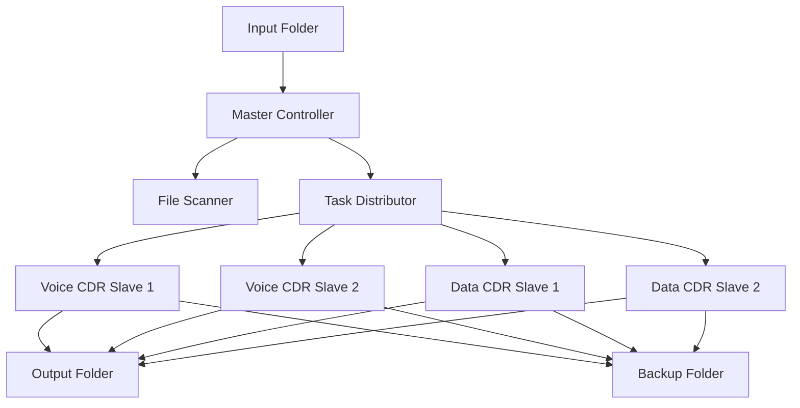
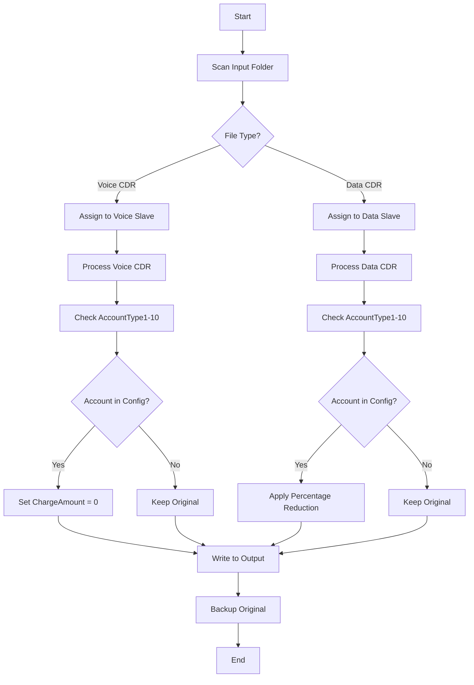
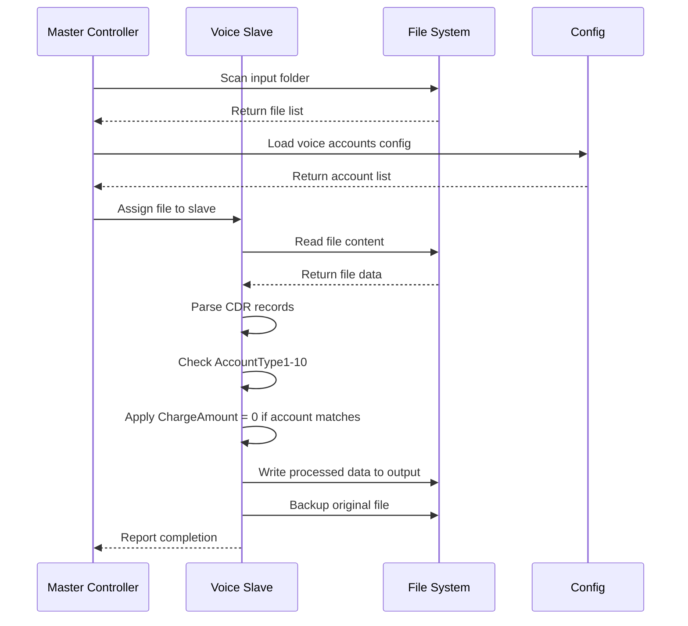
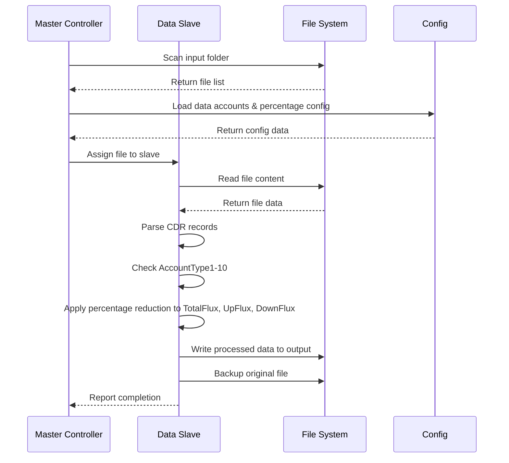

# Tài Liệu Thiết Kế Hệ Thống Xử Lý Dữ Liệu CDR

## 1. Tổng Quan Hệ Thống

### 1.1 Mục Đích
Hệ thống xử lý dữ liệu CDR (Call Detail Record) được thiết kế để xử lý các file text chứa dữ liệu cuộc gọi và dữ liệu data, thực hiện các thao tác chỉnh sửa hoặc xóa các trường thông tin theo cấu hình.

### 1.2 Phạm Vi
- Xử lý dữ liệu Voice CDR: Giảm trừ ChargeAmount về 0 cho các tài khoản được cấu hình
- Xử lý dữ liệu Data CDR: Giảm trừ TotalFlux, UpFlux, DownFlux theo tỷ lệ phần trăm
- Kiến trúc Master-Slave để xử lý song song
- Cấu hình linh hoạt cho input, output, backup folders

## 2. Kiến Trúc Hệ Thống

### 2.1 Kiến Trúc Tổng Thể



### 2.2 Luồng Xử Lý Chính



## 3. Thiết Kế Chi Tiết

### 3.1 Cấu Trúc Dự Án Java

```
src/
├── main/
│   ├── java/
│   │   ├── com/
│   │   │   └── cdr/
│   │   │       ├── processor/
│   │   │       │   ├── MasterController.java
│   │   │       │   ├── SlaveProcessor.java
│   │   │       │   ├── VoiceCDRProcessor.java
│   │   │       │   └── DataCDRProcessor.java
│   │   │       ├── config/
│   │   │       │   ├── SystemConfig.java
│   │   │       │   └── CDRConfig.java
│   │   │       ├── model/
│   │   │       │   ├── CDRRecord.java
│   │   │       │   ├── VoiceCDR.java
│   │   │       │   └── DataCDR.java
│   │   │       ├── util/
│   │   │       │   ├── FileUtils.java
│   │   │       │   └── ConfigUtils.java
│   │   │       └── CDRProcessorApplication.java
│   │   └── resources/
│   │       ├── application.properties
│   │       └── cdr-config.xml
```

### 3.2 Cấu Hình Hệ Thống

#### 3.2.1 File application.properties
```properties
# Folder Configuration
cdr.input.folder=/data/input
cdr.output.folder=/data/output
cdr.backup.folder=/data/backup

# Slave Configuration
cdr.voice.slaves=2
cdr.data.slaves=2

# Processing Configuration
cdr.batch.size=1000
cdr.thread.pool.size=10

# Account Configuration
cdr.voice.accounts=ACC001,ACC002,ACC003
cdr.data.accounts=DATA001,DATA002
cdr.data.reduction.percentage=50.0
```

#### 3.2.2 File cdr-config.xml
```xml
<?xml version="1.0" encoding="UTF-8"?>
<cdr-config>
    <voice-processing>
        <accounts>
            <account>ACC001</account>
            <account>ACC002</account>
            <account>ACC003</account>
        </accounts>
        <action>SET_CHARGE_TO_ZERO</action>
    </voice-processing>
    
    <data-processing>
        <accounts>
            <account>DATA001</account>
            <account>DATA002</account>
        </accounts>
        <reduction-percentage>50.0</reduction-percentage>
        <fields>
            <field>TotalFlux</field>
            <field>UpFlux</field>
            <field>DownFlux</field>
        </fields>
    </data-processing>
</cdr-config>
```

### 3.3 Luồng Xử Lý Chi Tiết

#### 3.3.1 Xử Lý Voice CDR



#### 3.3.2 Xử Lý Data CDR



## 4. Triển Khai Chi Tiết

### 4.1 Master Controller

```java
@Component
public class MasterController {
    
    @Value("${cdr.input.folder}")
    private String inputFolder;
    
    @Value("${cdr.voice.slaves}")
    private int voiceSlaves;
    
    @Value("${cdr.data.slaves}")
    private int dataSlaves;
    
    private ExecutorService voiceExecutor;
    private ExecutorService dataExecutor;
    
    @PostConstruct
    public void initialize() {
        voiceExecutor = Executors.newFixedThreadPool(voiceSlaves);
        dataExecutor = Executors.newFixedThreadPool(dataSlaves);
    }
    
    public void processFiles() {
        List<File> files = scanInputFolder();
        
        for (File file : files) {
            if (isVoiceCDR(file)) {
                voiceExecutor.submit(new VoiceCDRProcessor(file));
            } else if (isDataCDR(file)) {
                dataExecutor.submit(new DataCDRProcessor(file));
            }
        }
    }
}
```

### 4.2 Voice CDR Processor

```java
public class VoiceCDRProcessor implements Runnable {
    
    private File inputFile;
    private List<String> configuredAccounts;
    
    public VoiceCDRProcessor(File inputFile) {
        this.inputFile = inputFile;
        this.configuredAccounts = loadVoiceAccounts();
    }
    
    @Override
    public void run() {
        try {
            List<VoiceCDR> records = parseVoiceCDR(inputFile);
            
            for (VoiceCDR record : records) {
                if (shouldProcessRecord(record)) {
                    record.setChargeAmount(0.0);
                }
            }
            
            writeProcessedFile(records);
            backupOriginalFile();
            
        } catch (Exception e) {
            log.error("Error processing voice CDR file: " + inputFile.getName(), e);
        }
    }
    
    private boolean shouldProcessRecord(VoiceCDR record) {
        for (int i = 1; i <= 10; i++) {
            String accountType = record.getAccountType(i);
            if (configuredAccounts.contains(accountType)) {
                return true;
            }
        }
        return false;
    }
}
```

### 4.3 Data CDR Processor

```java
public class DataCDRProcessor implements Runnable {
    
    private File inputFile;
    private List<String> configuredAccounts;
    private double reductionPercentage;
    
    public DataCDRProcessor(File inputFile) {
        this.inputFile = inputFile;
        this.configuredAccounts = loadDataAccounts();
        this.reductionPercentage = loadReductionPercentage();
    }
    
    @Override
    public void run() {
        try {
            List<DataCDR> records = parseDataCDR(inputFile);
            
            for (DataCDR record : records) {
                if (shouldProcessRecord(record)) {
                    applyReduction(record);
                }
            }
            
            writeProcessedFile(records);
            backupOriginalFile();
            
        } catch (Exception e) {
            log.error("Error processing data CDR file: " + inputFile.getName(), e);
        }
    }
    
    private void applyReduction(DataCDR record) {
        double multiplier = (100 - reductionPercentage) / 100.0;
        
        record.setTotalFlux(record.getTotalFlux() * multiplier);
        record.setUpFlux(record.getUpFlux() * multiplier);
        record.setDownFlux(record.getDownFlux() * multiplier);
    }
}
```

## 5. Cấu Hình Triển Khai

### 5.1 Yêu Cầu Hệ Thống
- Java 8 trở lên
- Spring Boot 2.x
- Maven hoặc Gradle
- RAM tối thiểu: 4GB
- Disk space: 100GB (tùy thuộc vào khối lượng dữ liệu)

### 5.2 Cấu Hình JVM
```bash
java -Xms2g -Xmx4g -XX:+UseG1GC -jar cdr-processor.jar
```

### 5.3 Monitoring và Logging
- Sử dụng SLF4J + Logback cho logging
- Metrics với Micrometer
- Health checks với Spring Boot Actuator

## 6. Testing và Validation

### 6.1 Unit Tests
- Test cho từng processor riêng biệt
- Test cho configuration loading
- Test cho file parsing logic

### 6.2 Integration Tests
- Test end-to-end processing
- Test với dữ liệu thực tế
- Performance testing với khối lượng lớn

## 7. Deployment và Maintenance

### 7.1 Deployment
- Sử dụng Docker container
- Kubernetes deployment cho scaling
- CI/CD pipeline với Jenkins/GitLab

### 7.2 Monitoring
- Application metrics
- File processing statistics
- Error rates và performance metrics

## 8. Kết Luận

Hệ thống được thiết kế với kiến trúc Master-Slave linh hoạt, có thể mở rộng và cấu hình dễ dàng. Việc xử lý song song giúp tăng hiệu suất xử lý, đặc biệt quan trọng với khối lượng dữ liệu lớn.

### 8.1 Ưu Điểm
- Kiến trúc scalable
- Cấu hình linh hoạt
- Xử lý song song hiệu quả
- Backup tự động

### 8.2 Cải Tiến Tương Lai
- Thêm real-time processing
- Machine learning cho pattern recognition
- Advanced monitoring và alerting
- API interface cho external systems
