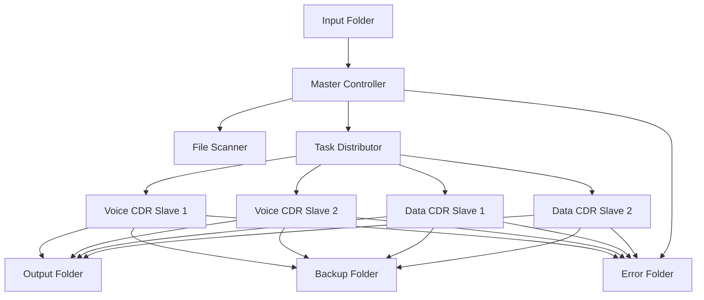
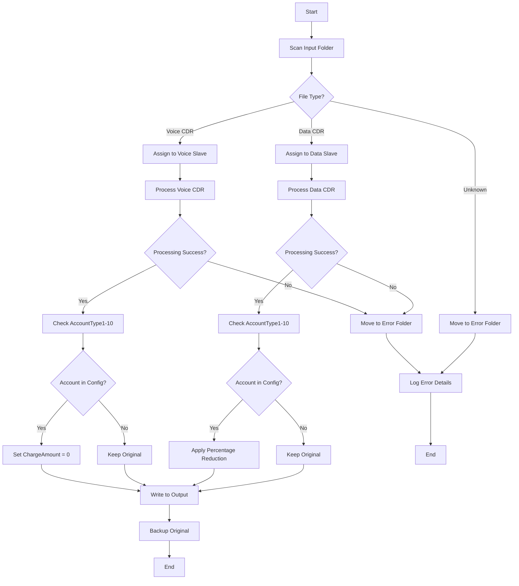
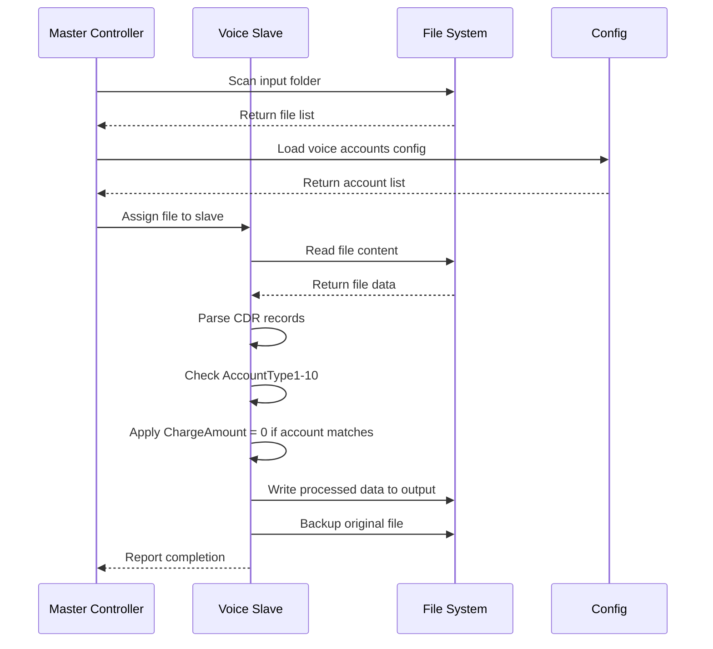
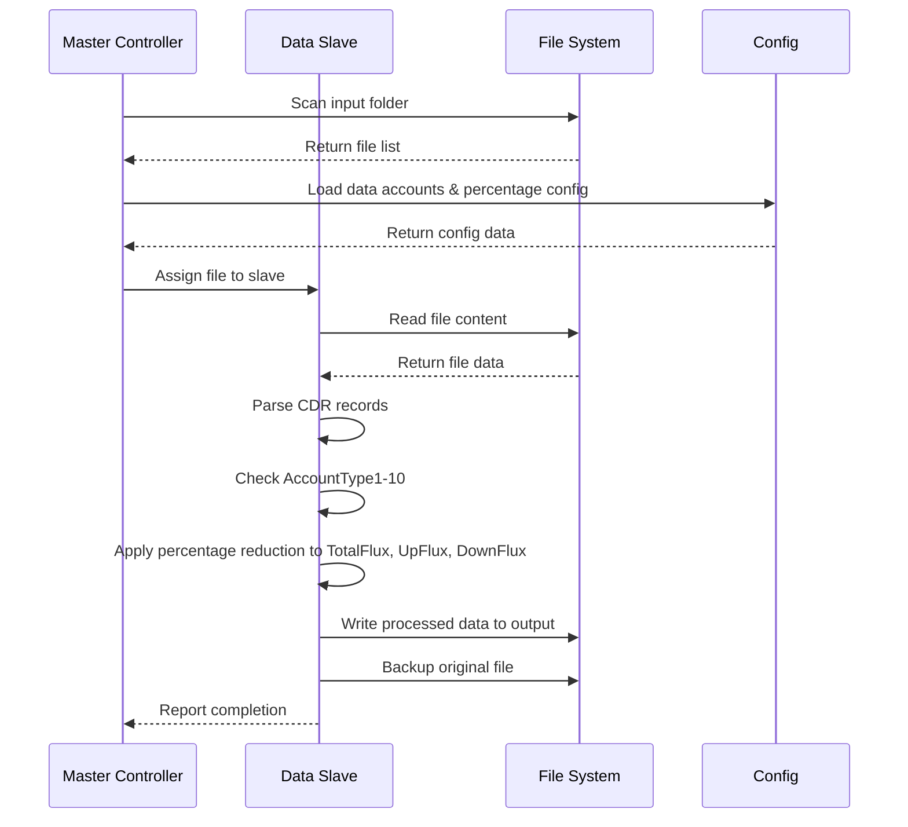
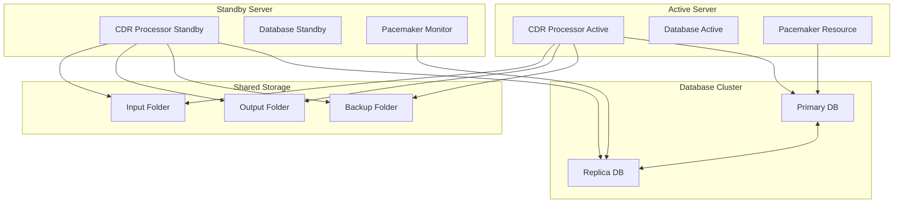
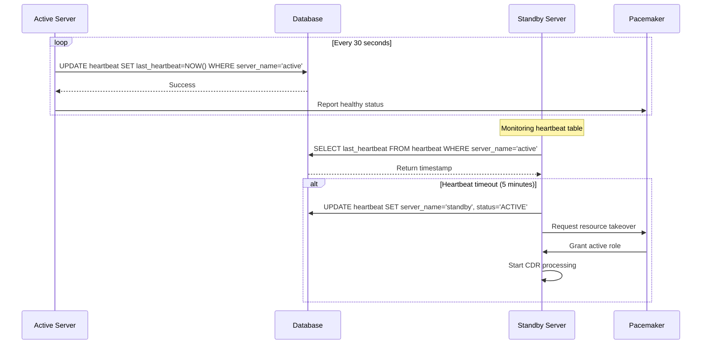
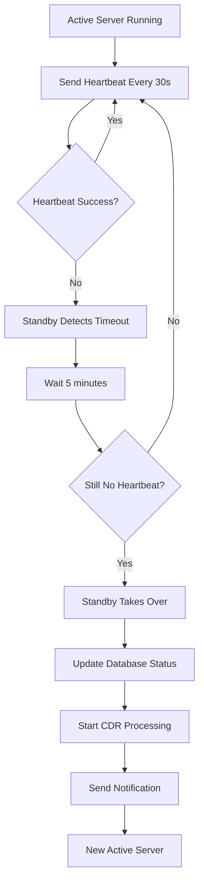

# Tài Liệu Thiết Kế Hệ Thống Xử Lý Dữ Liệu CDR

## 1. Tổng Quan Hệ Thống

### 1.1 Mục Đích
Hệ thống xử lý dữ liệu CDR (Call Detail Record) được thiết kế để xử lý các file text chứa dữ liệu cuộc gọi và dữ liệu data, thực hiện các thao tác chỉnh sửa hoặc xóa các trường thông tin theo cấu hình.

### 1.2 Phạm Vi
- Xử lý dữ liệu Voice CDR: Giảm trừ ChargeAmount về 0 cho các tài khoản được cấu hình
- Xử lý dữ liệu Data CDR: Giảm trừ TotalFlux, UpFlux, DownFlux theo tỷ lệ phần trăm
- Kiến trúc Master-Slave để xử lý song song
- Cấu hình linh hoạt cho input, output, backup folders

## 2. Kiến Trúc Hệ Thống

### 2.1 Kiến Trúc Tổng Thể



### 2.2 Luồng Xử Lý Chính



## 3. Thiết Kế Chi Tiết

### 3.1 Cấu Trúc Dự Án Java

```
src/
├── main/
│   ├── java/
│   │   ├── com/
│   │   │   └── cdr/
│   │   │       ├── processor/
│   │   │       │   ├── MasterController.java
│   │   │       │   ├── SlaveProcessor.java
│   │   │       │   ├── VoiceCDRProcessor.java
│   │   │       │   └── DataCDRProcessor.java
│   │   │       ├── config/
│   │   │       │   ├── SystemConfig.java
│   │   │       │   └── CDRConfig.java
│   │   │       ├── model/
│   │   │       │   ├── CDRRecord.java
│   │   │       │   ├── VoiceCDR.java
│   │   │       │   └── DataCDR.java
│   │   │       ├── util/
│   │   │       │   ├── FileUtils.java
│   │   │       │   └── ConfigUtils.java
│   │   │       └── CDRProcessorMain.java
│   │   └── resources/
│   │       ├── application.properties
│   │       └── cdr-config.properties
├── wrapper/
│   ├── wrapper.jar
│   ├── wrapper.conf
│   ├── wrapper-license.conf
│   └── lib/
│       └── wrapper-*.jar
└── target/
    └── cdr-processor.jar
```

### 3.2 Cấu Hình Hệ Thống

#### 3.2.1 File application.properties
```properties
# Folder Configuration
cdr.input.folder=/data/input
cdr.output.folder=/data/output
cdr.backup.folder=/data/backup
cdr.error.folder=/data/error

# Slave Configuration
cdr.voice.slaves=2
cdr.data.slaves=2

# Processing Configuration
cdr.batch.size=1000
cdr.thread.pool.size=10

# Account Configuration
cdr.voice.accounts=ACC001,ACC002,ACC003
cdr.data.accounts=DATA001,DATA002
cdr.data.reduction.percentage=50.0

# High Availability Configuration
cdr.server.name=${HOSTNAME:cdr-server-01}
cdr.heartbeat.interval=30000
cdr.heartbeat.timeout=300000
cdr.heartbeat.check.interval=60000

# Database Configuration
cdr.database.url=jdbc:mysql://localhost:3306/cdr_db
cdr.database.username=cdr_user
cdr.database.password=${DB_PASSWORD}
cdr.database.driver=com.mysql.cj.jdbc.Driver
cdr.database.pool.size=10
cdr.database.pool.max=20

# Logging Configuration
cdr.logging.level=INFO
cdr.logging.file=/var/log/cdr-processor/cdr-processor.log
cdr.logging.max.size=100MB
cdr.logging.max.files=10
```

#### 3.2.2 File cdr-config.properties
```properties
# Voice CDR Processing Configuration
cdr.voice.accounts=ACC001,ACC002,ACC003
cdr.voice.action=SET_CHARGE_TO_ZERO
cdr.voice.charge.amount=0.0

# Data CDR Processing Configuration
cdr.data.accounts=DATA001,DATA002
cdr.data.reduction.percentage=50.0
cdr.data.fields=TotalFlux,UpFlux,DownFlux

# File Processing Configuration
cdr.file.encoding=UTF-8
cdr.file.delimiter=|
cdr.file.quote.character="
cdr.file.escape.character=\\

# Voice CDR Field Mapping
cdr.voice.fields.accounttype1=AccountType1
cdr.voice.fields.accounttype2=AccountType2
cdr.voice.fields.accounttype3=AccountType3
cdr.voice.fields.accounttype4=AccountType4
cdr.voice.fields.accounttype5=AccountType5
cdr.voice.fields.accounttype6=AccountType6
cdr.voice.fields.accounttype7=AccountType7
cdr.voice.fields.accounttype8=AccountType8
cdr.voice.fields.accounttype9=AccountType9
cdr.voice.fields.accounttype10=AccountType10
cdr.voice.fields.chargeamount=ChargeAmount

# Data CDR Field Mapping
cdr.data.fields.accounttype1=AccountType1
cdr.data.fields.accounttype2=AccountType2
cdr.data.fields.accounttype3=AccountType3
cdr.data.fields.accounttype4=AccountType4
cdr.data.fields.accounttype5=AccountType5
cdr.data.fields.accounttype6=AccountType6
cdr.data.fields.accounttype7=AccountType7
cdr.data.fields.accounttype8=AccountType8
cdr.data.fields.accounttype9=AccountType9
cdr.data.fields.accounttype10=AccountType10
cdr.data.fields.totalflux=TotalFlux
cdr.data.fields.upflux=UpFlux
cdr.data.fields.downflux=DownFlux

# Processing Rules
cdr.processing.rule.voice.enabled=true
cdr.processing.rule.data.enabled=true
cdr.processing.rule.backup.enabled=true
cdr.processing.rule.validation.enabled=true

# Validation Rules
cdr.validation.required.fields.voice=AccountType1,ChargeAmount
cdr.validation.required.fields.data=AccountType1,TotalFlux,UpFlux,DownFlux
cdr.validation.numeric.fields=ChargeAmount,TotalFlux,UpFlux,DownFlux
```

### 3.3 Luồng Xử Lý Chi Tiết

#### 3.3.1 Xử Lý Voice CDR



#### 3.3.2 Xử Lý Data CDR



## 4. Triển Khai Chi Tiết

### 4.1 Master Controller

```java
public class MasterController {
    
    private String inputFolder;
    private int voiceSlaves;
    private int dataSlaves;
    private ExecutorService voiceExecutor;
    private ExecutorService dataExecutor;
    private SystemConfig systemConfig;
    private static final Logger log = LoggerFactory.getLogger(MasterController.class);
    
    public MasterController(SystemConfig config) {
        this.systemConfig = config;
        this.inputFolder = config.getInputFolder();
        this.voiceSlaves = config.getVoiceSlaves();
        this.dataSlaves = config.getDataSlaves();
        initialize();
    }
    
    public void initialize() {
        voiceExecutor = Executors.newFixedThreadPool(voiceSlaves);
        dataExecutor = Executors.newFixedThreadPool(dataSlaves);
        log.info("Master Controller initialized with {} voice slaves and {} data slaves", 
                voiceSlaves, dataSlaves);
    }
    
    public void processFiles() {
        List<File> files = scanInputFolder();
        log.info("Found {} files to process", files.size());
        
        for (File file : files) {
            try {
            if (isVoiceCDR(file)) {
                    voiceExecutor.submit(new VoiceCDRProcessor(file, systemConfig));
            } else if (isDataCDR(file)) {
                    dataExecutor.submit(new DataCDRProcessor(file, systemConfig));
                } else {
                    log.warn("Unknown file type: {}", file.getName());
                    moveToErrorFolder(file, "UNKNOWN_FILE_TYPE");
                }
            } catch (Exception e) {
                log.error("Error processing file: {}", file.getName(), e);
                moveToErrorFolder(file, "PROCESSING_ERROR: " + e.getMessage());
            }
        }
    }
    
    private void moveToErrorFolder(File file, String errorReason) {
        try {
            File errorFolder = new File(systemConfig.getErrorFolder());
            if (!errorFolder.exists()) {
                errorFolder.mkdirs();
            }
            
            String timestamp = new SimpleDateFormat("yyyyMMdd_HHmmss").format(new Date());
            String errorFileName = String.format("%s_%s_%s", 
                FileUtils.getNameWithoutExtension(file.getName()), 
                timestamp, 
                errorReason.replaceAll("[^a-zA-Z0-9]", "_"));
            
            File errorFile = new File(errorFolder, errorFileName + FileUtils.getExtension(file.getName()));
            Files.move(file.toPath(), errorFile.toPath(), StandardCopyOption.REPLACE_EXISTING);
            
            log.error("Moved file {} to error folder: {}", file.getName(), errorFile.getAbsolutePath());
            
            // Log error details to error log file
            logErrorDetails(file, errorReason, errorFile);
            
        } catch (Exception e) {
            log.error("Failed to move file {} to error folder", file.getName(), e);
        }
    }
    
    private void logErrorDetails(File originalFile, String errorReason, File errorFile) {
        try {
            File errorLogFile = new File(systemConfig.getErrorFolder(), "error_log.txt");
            try (PrintWriter writer = new PrintWriter(new FileWriter(errorLogFile, true))) {
                writer.println(String.format("[%s] ERROR: %s", 
                    new SimpleDateFormat("yyyy-MM-dd HH:mm:ss").format(new Date()),
                    errorReason));
                writer.println(String.format("Original File: %s", originalFile.getAbsolutePath()));
                writer.println(String.format("Error File: %s", errorFile.getAbsolutePath()));
                writer.println("---");
            }
        } catch (Exception e) {
            log.error("Failed to log error details", e);
        }
    }
    
    public void shutdown() {
        log.info("Shutting down Master Controller...");
        voiceExecutor.shutdown();
        dataExecutor.shutdown();
        try {
            if (!voiceExecutor.awaitTermination(60, TimeUnit.SECONDS)) {
                voiceExecutor.shutdownNow();
            }
            if (!dataExecutor.awaitTermination(60, TimeUnit.SECONDS)) {
                dataExecutor.shutdownNow();
            }
        } catch (InterruptedException e) {
            Thread.currentThread().interrupt();
        }
    }
}
```

### 4.2 Main Application Class

```java
public class CDRProcessorMain {
    
    private static final Logger log = LoggerFactory.getLogger(CDRProcessorMain.class);
    private MasterController masterController;
    private HeartbeatService heartbeatService;
    private SystemConfig systemConfig;
    private DataSource dataSource;
    private volatile boolean running = true;
    
    public static void main(String[] args) {
        CDRProcessorMain app = new CDRProcessorMain();
        
        // Add shutdown hook
        Runtime.getRuntime().addShutdownHook(new Thread(() -> {
            log.info("Shutdown signal received...");
            app.shutdown();
        }));
        
        try {
            app.start();
        } catch (Exception e) {
            log.error("Failed to start CDR Processor", e);
            System.exit(1);
        }
    }
    
    public void start() throws Exception {
        log.info("Starting CDR Processor Application...");
        
        // Load configuration
        systemConfig = ConfigUtils.loadSystemConfig();
        
        // Initialize database connection
        dataSource = DatabaseUtils.createDataSource(systemConfig);
        
        // Initialize heartbeat service
        heartbeatService = new HeartbeatService(systemConfig, dataSource);
        heartbeatService.startHeartbeat();
        
        // Initialize master controller
        masterController = new MasterController(systemConfig);
        
        // Start processing
        startProcessing();
        
        log.info("CDR Processor Application started successfully");
    }
    
    private void startProcessing() {
        new Thread(() -> {
            while (running) {
                try {
                    masterController.processFiles();
                    Thread.sleep(systemConfig.getProcessingInterval());
                } catch (InterruptedException e) {
                    Thread.currentThread().interrupt();
                    break;
                } catch (Exception e) {
                    log.error("Error during processing", e);
                }
            }
        }).start();
    }
    
    public void shutdown() {
        log.info("Shutting down CDR Processor Application...");
        running = false;
        
        if (masterController != null) {
            masterController.shutdown();
        }
        
        if (heartbeatService != null) {
            heartbeatService.shutdown();
        }
        
        log.info("CDR Processor Application shutdown completed");
    }
}
```

### 4.3 Configuration Utils

```java
@Component
public class ConfigUtils {
    
    @Value("${cdr.voice.accounts}")
    private String voiceAccounts;
    
    @Value("${cdr.data.accounts}")
    private String dataAccounts;
    
    @Value("${cdr.data.reduction.percentage}")
    private double reductionPercentage;
    
    @Value("${cdr.voice.charge.amount}")
    private double chargeAmount;
    
    @Value("${cdr.file.delimiter}")
    private String delimiter;
    
    @Value("${cdr.file.encoding}")
    private String encoding;
    
    public List<String> getVoiceAccounts() {
        return Arrays.asList(voiceAccounts.split(","));
    }
    
    public List<String> getDataAccounts() {
        return Arrays.asList(dataAccounts.split(","));
    }
    
    public double getReductionPercentage() {
        return reductionPercentage;
    }
    
    public double getChargeAmount() {
        return chargeAmount;
    }
    
    public String getDelimiter() {
        return delimiter;
    }
    
    public String getEncoding() {
        return encoding;
    }
    
    public boolean isVoiceProcessingEnabled() {
        return true; // Can be made configurable
    }
    
    public boolean isDataProcessingEnabled() {
        return true; // Can be made configurable
    }
}
```

### 4.3 Voice CDR Processor

```java
public class VoiceCDRProcessor implements Runnable {
    
    private File inputFile;
    private ConfigUtils configUtils;
    
    public VoiceCDRProcessor(File inputFile, ConfigUtils configUtils) {
        this.inputFile = inputFile;
        this.configUtils = configUtils;
    }
    
    @Override
    public void run() {
        try {
            log.info("Processing voice CDR file: {}", inputFile.getName());
            List<VoiceCDR> records = parseVoiceCDR(inputFile);
            
            for (VoiceCDR record : records) {
                if (shouldProcessRecord(record)) {
                    record.setChargeAmount(0.0);
                }
            }
            
            writeProcessedFile(records);
            backupOriginalFile();
            log.info("Successfully processed voice CDR file: {}", inputFile.getName());
            
        } catch (Exception e) {
            log.error("Error processing voice CDR file: " + inputFile.getName(), e);
            moveToErrorFolder(e);
        }
    }
    
    private void moveToErrorFolder(Exception e) {
        try {
            File errorFolder = new File(systemConfig.getErrorFolder());
            if (!errorFolder.exists()) {
                errorFolder.mkdirs();
            }
            
            String timestamp = new SimpleDateFormat("yyyyMMdd_HHmmss").format(new Date());
            String errorFileName = String.format("%s_%s_VOICE_ERROR_%s", 
                FileUtils.getNameWithoutExtension(inputFile.getName()), 
                timestamp,
                e.getClass().getSimpleName());
            
            File errorFile = new File(errorFolder, errorFileName + FileUtils.getExtension(inputFile.getName()));
            Files.move(inputFile.toPath(), errorFile.toPath(), StandardCopyOption.REPLACE_EXISTING);
            
            log.error("Moved failed voice CDR file {} to error folder: {}", 
                inputFile.getName(), errorFile.getAbsolutePath());
            
            // Log detailed error information
            logDetailedError(inputFile, errorFile, e);
            
        } catch (Exception moveException) {
            log.error("Failed to move voice CDR file {} to error folder", inputFile.getName(), moveException);
        }
    }
    
    private void logDetailedError(File originalFile, File errorFile, Exception e) {
        try {
            File errorLogFile = new File(systemConfig.getErrorFolder(), "voice_error_log.txt");
            try (PrintWriter writer = new PrintWriter(new FileWriter(errorLogFile, true))) {
                writer.println(String.format("[%s] VOICE CDR PROCESSING ERROR", 
                    new SimpleDateFormat("yyyy-MM-dd HH:mm:ss").format(new Date())));
                writer.println(String.format("Original File: %s", originalFile.getAbsolutePath()));
                writer.println(String.format("Error File: %s", errorFile.getAbsolutePath()));
                writer.println(String.format("Error Type: %s", e.getClass().getSimpleName()));
                writer.println(String.format("Error Message: %s", e.getMessage()));
                writer.println("Stack Trace:");
                e.printStackTrace(writer);
                writer.println("---");
            }
        } catch (Exception logException) {
            log.error("Failed to log detailed error information", logException);
        }
    }
    
    private boolean shouldProcessRecord(VoiceCDR record) {
        for (int i = 1; i <= 10; i++) {
            String accountType = record.getAccountType(i);
            if (configuredAccounts.contains(accountType)) {
                return true;
            }
        }
        return false;
    }
}
```

### 4.3 Data CDR Processor

```java
public class DataCDRProcessor implements Runnable {
    
    private File inputFile;
    private List<String> configuredAccounts;
    private double reductionPercentage;
    
    public DataCDRProcessor(File inputFile) {
        this.inputFile = inputFile;
        this.configuredAccounts = loadDataAccounts();
        this.reductionPercentage = loadReductionPercentage();
    }
    
    @Override
    public void run() {
        try {
            log.info("Processing data CDR file: {}", inputFile.getName());
            List<DataCDR> records = parseDataCDR(inputFile);
            
            for (DataCDR record : records) {
                if (shouldProcessRecord(record)) {
                    applyReduction(record);
                }
            }
            
            writeProcessedFile(records);
            backupOriginalFile();
            log.info("Successfully processed data CDR file: {}", inputFile.getName());
            
        } catch (Exception e) {
            log.error("Error processing data CDR file: " + inputFile.getName(), e);
            moveToErrorFolder(e);
        }
    }
    
    private void moveToErrorFolder(Exception e) {
        try {
            File errorFolder = new File(systemConfig.getErrorFolder());
            if (!errorFolder.exists()) {
                errorFolder.mkdirs();
            }
            
            String timestamp = new SimpleDateFormat("yyyyMMdd_HHmmss").format(new Date());
            String errorFileName = String.format("%s_%s_DATA_ERROR_%s", 
                FileUtils.getNameWithoutExtension(inputFile.getName()), 
                timestamp,
                e.getClass().getSimpleName());
            
            File errorFile = new File(errorFolder, errorFileName + FileUtils.getExtension(inputFile.getName()));
            Files.move(inputFile.toPath(), errorFile.toPath(), StandardCopyOption.REPLACE_EXISTING);
            
            log.error("Moved failed data CDR file {} to error folder: {}", 
                inputFile.getName(), errorFile.getAbsolutePath());
            
            // Log detailed error information
            logDetailedError(inputFile, errorFile, e);
            
        } catch (Exception moveException) {
            log.error("Failed to move data CDR file {} to error folder", inputFile.getName(), moveException);
        }
    }
    
    private void logDetailedError(File originalFile, File errorFile, Exception e) {
        try {
            File errorLogFile = new File(systemConfig.getErrorFolder(), "data_error_log.txt");
            try (PrintWriter writer = new PrintWriter(new FileWriter(errorLogFile, true))) {
                writer.println(String.format("[%s] DATA CDR PROCESSING ERROR", 
                    new SimpleDateFormat("yyyy-MM-dd HH:mm:ss").format(new Date())));
                writer.println(String.format("Original File: %s", originalFile.getAbsolutePath()));
                writer.println(String.format("Error File: %s", errorFile.getAbsolutePath()));
                writer.println(String.format("Error Type: %s", e.getClass().getSimpleName()));
                writer.println(String.format("Error Message: %s", e.getMessage()));
                writer.println("Stack Trace:");
                e.printStackTrace(writer);
                writer.println("---");
            }
        } catch (Exception logException) {
            log.error("Failed to log detailed error information", logException);
        }
    }
    
    private void applyReduction(DataCDR record) {
        double multiplier = (100 - reductionPercentage) / 100.0;
        
        record.setTotalFlux(record.getTotalFlux() * multiplier);
        record.setUpFlux(record.getUpFlux() * multiplier);
        record.setDownFlux(record.getDownFlux() * multiplier);
    }
}
```

## 5. Cấu Hình Triển Khai

### 5.1 Yêu Cầu Hệ Thống
- Java 8 trở lên
- Maven hoặc Gradle
- RAM tối thiểu: 4GB
- Disk space: 100GB (tùy thuộc vào khối lượng dữ liệu)
- Java Service Wrapper 3.5.54+

### 5.2 Java Service Wrapper Configuration

#### 5.2.1 Wrapper Configuration File (wrapper.conf)
```properties
# Wrapper Configuration
wrapper.java.command=java
wrapper.java.mainclass=org.tanukisoftware.wrapper.WrapperJarApp
wrapper.java.classpath.1=wrapper.jar
wrapper.java.classpath.2=../target/cdr-processor.jar
wrapper.java.classpath.3=../lib/*.jar

# Application Configuration
wrapper.app.parameter.1=com.cdr.CDRProcessorMain
wrapper.java.additional.1=-Xms2g
wrapper.java.additional.2=-Xmx4g
wrapper.java.additional.3=-XX:+UseG1GC
wrapper.java.additional.4=-Dfile.encoding=UTF-8
wrapper.java.additional.5=-Djava.security.manager
wrapper.java.additional.6=-Djava.security.policy=wrapper.policy

# JVM Options
wrapper.java.maxmemory=4096
wrapper.java.initmemory=2048

# Service Configuration
wrapper.service.name=cdr-processor
wrapper.service.displayname=CDR Processor Service
wrapper.service.description=CDR Processing System for Voice and Data Records
wrapper.service.starttype=AUTO_START

# Logging Configuration
wrapper.logfile=../logs/wrapper.log
wrapper.logfile.maxsize=10m
wrapper.logfile.maxfiles=5
wrapper.console.loglevel=INFO
wrapper.logfile.loglevel=INFO

# Process Management
wrapper.pidfile=../logs/cdr-processor.pid
wrapper.daemonize=TRUE
wrapper.ntservice.interactive=FALSE

# Restart Configuration
wrapper.restart.reload_configuration=TRUE
wrapper.restart.auto=TRUE
wrapper.restart.delay=5
wrapper.restart.max=5

# Shutdown Configuration
wrapper.shutdown.timeout=60
wrapper.java.shutdown.timeout=30
```

#### 5.2.2 Wrapper License Configuration (wrapper-license.conf)
```properties
# Wrapper License Configuration
wrapper.license.type=GPL
wrapper.license.version=3.5.54
```

#### 5.2.3 Maven Configuration (pom.xml)
```xml
<project xmlns="http://maven.apache.org/POM/4.0.0"
         xmlns:xsi="http://www.w3.org/2001/XMLSchema-instance"
         xsi:schemaLocation="http://maven.apache.org/POM/4.0.0 
         http://maven.apache.org/xsd/maven-4.0.0.xsd">
    <modelVersion>4.0.0</modelVersion>
    
    <groupId>com.cdr</groupId>
    <artifactId>cdr-processor</artifactId>
    <version>1.0.0</version>
    <packaging>jar</packaging>
    
    <properties>
        <maven.compiler.source>8</maven.compiler.source>
        <maven.compiler.target>8</maven.compiler.target>
        <project.build.sourceEncoding>UTF-8</project.build.sourceEncoding>
    </properties>
    
    <dependencies>
        <!-- Database -->
        <dependency>
            <groupId>mysql</groupId>
            <artifactId>mysql-connector-java</artifactId>
            <version>8.0.33</version>
        </dependency>
        
        <!-- Connection Pool -->
        <dependency>
            <groupId>com.zaxxer</groupId>
            <artifactId>HikariCP</artifactId>
            <version>5.0.1</version>
        </dependency>
        
        <!-- Logging -->
        <dependency>
            <groupId>org.slf4j</groupId>
            <artifactId>slf4j-api</artifactId>
            <version>1.7.36</version>
        </dependency>
        <dependency>
            <groupId>ch.qos.logback</groupId>
            <artifactId>logback-classic</artifactId>
            <version>1.2.12</version>
        </dependency>
        
        <!-- Java Service Wrapper -->
        <dependency>
            <groupId>org.tanukisoftware.wrapper</groupId>
            <artifactId>wrapper</artifactId>
            <version>3.5.54</version>
        </dependency>
    </dependencies>
    
    <build>
        <plugins>
            <plugin>
                <groupId>org.apache.maven.plugins</groupId>
                <artifactId>maven-compiler-plugin</artifactId>
                <version>3.11.0</version>
                <configuration>
                    <source>8</source>
                    <target>8</target>
                </configuration>
            </plugin>
            
            <plugin>
                <groupId>org.apache.maven.plugins</groupId>
                <artifactId>maven-shade-plugin</artifactId>
                <version>3.4.1</version>
                <executions>
                    <execution>
                        <phase>package</phase>
                        <goals>
                            <goal>shade</goal>
                        </goals>
                        <configuration>
                            <transformers>
                                <transformer implementation="org.apache.maven.plugins.shade.resource.ManifestResourceTransformer">
                                    <mainClass>com.cdr.CDRProcessorMain</mainClass>
                                </transformer>
                            </transformers>
                        </configuration>
                    </execution>
                </executions>
            </plugin>
        </plugins>
    </build>
</project>
```

### 5.3 Service Management Commands

```bash
# Install service
./wrapper install

# Start service
./wrapper start

# Stop service
./wrapper stop

# Restart service
./wrapper restart

# Check status
./wrapper status

# Uninstall service
./wrapper remove

# Console mode (for debugging)
./wrapper console
```

### 5.4 Error Handling và Monitoring

#### 5.4.1 Error Folder Structure
```
/data/error/
├── voice_error_log.txt          # Voice CDR error log
├── data_error_log.txt           # Data CDR error log
├── error_log.txt                # General error log
├── voice_cdr_20241201_143022_ParseException.txt
├── data_cdr_20241201_143045_IOException.txt
└── unknown_file_20241201_143100_UNKNOWN_FILE_TYPE.txt
```

#### 5.4.2 Error Types và Handling
- **ParseException**: File format không đúng
- **IOException**: Lỗi đọc/ghi file
- **ValidationException**: Dữ liệu không hợp lệ
- **DatabaseException**: Lỗi kết nối database
- **UnknownFileType**: Loại file không được hỗ trợ

#### 5.4.3 Error Monitoring
```java
public class ErrorMonitor {
    
    private static final Logger log = LoggerFactory.getLogger(ErrorMonitor.class);
    private final File errorFolder;
    private final AtomicLong errorCount = new AtomicLong(0);
    private final Map<String, AtomicLong> errorTypes = new ConcurrentHashMap<>();
    
    public ErrorMonitor(SystemConfig config) {
        this.errorFolder = new File(config.getErrorFolder());
    }
    
    public void recordError(String errorType, String fileName) {
        errorCount.incrementAndGet();
        errorTypes.computeIfAbsent(errorType, k -> new AtomicLong(0)).incrementAndGet();
        
        log.error("Error recorded - Type: {}, File: {}, Total Errors: {}", 
            errorType, fileName, errorCount.get());
        
        // Alert if error rate is too high
        if (errorCount.get() > 100) {
            sendAlert("High error rate detected: " + errorCount.get() + " errors");
        }
    }
    
    public Map<String, Object> getErrorStatistics() {
        Map<String, Object> stats = new HashMap<>();
        stats.put("totalErrors", errorCount.get());
        stats.put("errorTypes", new HashMap<>(errorTypes));
        stats.put("errorFolderSize", getErrorFolderSize());
        return stats;
    }
    
    private long getErrorFolderSize() {
        return Arrays.stream(errorFolder.listFiles())
            .mapToLong(File::length)
            .sum();
    }
    
    private void sendAlert(String message) {
        // Implementation for sending alerts (email, SMS, etc.)
        log.warn("ALERT: {}", message);
    }
}
```

### 5.5 Monitoring và Logging
- Sử dụng SLF4J + Logback cho logging
- Java Service Wrapper logging
- Custom metrics collection
- Health checks với custom endpoints
- Error monitoring và alerting

## 6. Testing và Validation

### 6.1 Unit Tests
- Test cho từng processor riêng biệt
- Test cho configuration loading
- Test cho file parsing logic

### 6.2 Integration Tests
- Test end-to-end processing
- Test với dữ liệu thực tế
- Performance testing với khối lượng lớn

## 7. Deployment và Maintenance

### 7.1 Active-Standby Deployment với Pacemaker

#### 7.1.1 Kiến Trúc High Availability



#### 7.1.2 Heartbeat Table Schema

```sql
CREATE TABLE system_heartbeat (
    id INT PRIMARY KEY AUTO_INCREMENT,
    server_name VARCHAR(50) NOT NULL,
    last_heartbeat TIMESTAMP DEFAULT CURRENT_TIMESTAMP,
    status ENUM('ACTIVE', 'STANDBY', 'FAILED') DEFAULT 'STANDBY',
    created_at TIMESTAMP DEFAULT CURRENT_TIMESTAMP,
    updated_at TIMESTAMP DEFAULT CURRENT_TIMESTAMP ON UPDATE CURRENT_TIMESTAMP
);

-- Insert initial records for both servers
INSERT INTO system_heartbeat (server_name, status) VALUES 
('cdr-server-01', 'STANDBY'),
('cdr-server-02', 'STANDBY');
```

#### 7.1.3 Heartbeat Monitoring Sequence



#### 7.1.4 Pacemaker Configuration

```bash
# /etc/corosync/corosync.conf
totem {
    version: 2
    secauth: off
    cluster_name: cdr-cluster
    transport: udpu
}

nodelist {
    node {
        ring0_addr: 192.168.1.10
        nodeid: 1
    }
    node {
        ring0_addr: 192.168.1.11
        nodeid: 2
    }
}

quorum {
    provider: corosync_votequorum
    expected_votes: 2
}

logging {
    to_logfile: yes
    logfile: /var/log/corosync/corosync.log
    to_syslog: yes
}
```

```bash
# Pacemaker resource configuration
pcs resource create cdr-processor systemd:cdr-processor \
    op monitor interval=30s timeout=10s \
    op start timeout=60s \
    op stop timeout=60s

pcs resource create cdr-vip IPaddr2 ip=192.168.1.100 \
    op monitor interval=30s timeout=10s

pcs resource create cdr-db ocf:heartbeat:mysql \
    op monitor interval=30s timeout=10s \
    op start timeout=60s \
    op stop timeout=60s

# Resource constraints
pcs constraint colocation add cdr-vip with cdr-processor INFINITY
pcs constraint colocation add cdr-db with cdr-processor INFINITY
pcs constraint order cdr-db then cdr-processor
```

#### 7.1.5 Heartbeat Service Implementation

```java
public class HeartbeatService {
    
    private String serverName;
    private long heartbeatInterval;
    private long heartbeatTimeout;
    private DataSource dataSource;
    private ScheduledExecutorService scheduler;
    private static final Logger log = LoggerFactory.getLogger(HeartbeatService.class);
    
    public HeartbeatService(SystemConfig config, DataSource dataSource) {
        this.serverName = config.getServerName();
        this.heartbeatInterval = config.getHeartbeatInterval();
        this.heartbeatTimeout = config.getHeartbeatTimeout();
        this.dataSource = dataSource;
        this.scheduler = Executors.newScheduledThreadPool(2);
    }
    
    public void startHeartbeat() {
        // Send heartbeat every 30 seconds
        scheduler.scheduleWithFixedDelay(this::sendHeartbeat, 0, heartbeatInterval, TimeUnit.MILLISECONDS);
        
        // Check active server every 60 seconds
        scheduler.scheduleWithFixedDelay(this::checkActiveServer, 60000, 60000, TimeUnit.MILLISECONDS);
        
        log.info("Heartbeat service started for server: {}", serverName);
    }
    
    public void sendHeartbeat() {
        try (Connection conn = dataSource.getConnection()) {
            String sql = "UPDATE system_heartbeat SET last_heartbeat = NOW() " +
                        "WHERE server_name = ? AND status = 'ACTIVE'";
            
            try (PreparedStatement stmt = conn.prepareStatement(sql)) {
                stmt.setString(1, serverName);
                int updated = stmt.executeUpdate();
                
                if (updated == 0) {
                    log.warn("No active heartbeat record found for server: {}", serverName);
                }
            }
            
        } catch (Exception e) {
            log.error("Failed to send heartbeat", e);
        }
    }
    
    public void checkActiveServer() {
        try (Connection conn = dataSource.getConnection()) {
            String sql = "SELECT last_heartbeat FROM system_heartbeat " +
                        "WHERE status = 'ACTIVE' AND server_name != ?";
            
            try (PreparedStatement stmt = conn.prepareStatement(sql)) {
                stmt.setString(1, serverName);
                try (ResultSet rs = stmt.executeQuery()) {
                    if (rs.next()) {
                        Timestamp lastHeartbeat = rs.getTimestamp("last_heartbeat");
                        long timeDiff = System.currentTimeMillis() - lastHeartbeat.getTime();
                        
                        if (timeDiff > heartbeatTimeout) {
                            log.warn("Active server heartbeat timeout detected. Taking over...");
                            takeOverActiveRole();
                        }
                    }
                }
            }
            
        } catch (Exception e) {
            log.error("Failed to check active server heartbeat", e);
        }
    }
    
    private void takeOverActiveRole() {
        try (Connection conn = dataSource.getConnection()) {
            String updateSql = "UPDATE system_heartbeat SET " +
                              "server_name = ?, status = 'ACTIVE', last_heartbeat = NOW() " +
                              "WHERE server_name != ?";
            
            try (PreparedStatement stmt = conn.prepareStatement(updateSql)) {
                stmt.setString(1, serverName);
                stmt.setString(2, serverName);
                stmt.executeUpdate();
            }
            
            // Start CDR processing
            startCDRProcessing();
            
            log.info("Successfully took over active role for server: {}", serverName);
            
        } catch (Exception e) {
            log.error("Failed to take over active role", e);
        }
    }
    
    public void shutdown() {
        log.info("Shutting down heartbeat service...");
        scheduler.shutdown();
        try {
            if (!scheduler.awaitTermination(30, TimeUnit.SECONDS)) {
                scheduler.shutdownNow();
            }
        } catch (InterruptedException e) {
            Thread.currentThread().interrupt();
        }
    }
}
```

### 7.2 Deployment Requirements

#### 7.2.1 Server Requirements
- **Active Server**: 8GB RAM, 4 CPU cores, 500GB storage
- **Standby Server**: 8GB RAM, 4 CPU cores, 500GB storage  
- **Shared Storage**: NFS or SAN for input/output/backup folders
- **Network**: Redundant network connections, dedicated heartbeat network

#### 7.2.2 Software Requirements
- **Operating System**: RHEL/CentOS 7+ or Ubuntu 18.04+
- **Pacemaker**: 1.1.19+
- **Corosync**: 2.4+
- **Database**: MySQL 5.7+ or PostgreSQL 10+ with replication
- **Java**: OpenJDK 8+ or Oracle JDK 8+
- **Java Service Wrapper**: 3.5.54+
- **Maven**: 3.6+ (for building)

#### 7.2.3 Network Configuration
```bash
# /etc/hosts
192.168.1.10 cdr-server-01
192.168.1.11 cdr-server-02
192.168.1.100 cdr-vip

# Firewall rules
firewall-cmd --permanent --add-service=high-availability
firewall-cmd --permanent --add-port=2224/tcp
firewall-cmd --permanent --add-port=3121/tcp
firewall-cmd --reload
```

### 7.3 Monitoring và Alerting

#### 7.3.1 Health Checks
- Database connectivity monitoring
- File system space monitoring  
- Application process monitoring
- Network connectivity checks

#### 7.3.2 Alerting Rules
```yaml
# Prometheus alerting rules
groups:
- name: cdr-processing
  rules:
  - alert: CDRProcessorDown
    expr: up{job="cdr-processor"} == 0
    for: 1m
    labels:
      severity: critical
    annotations:
      summary: "CDR Processor is down"
      
  - alert: HeartbeatTimeout
    expr: time() - mysql_heartbeat_last_update > 300
    for: 1m
    labels:
      severity: critical
    annotations:
      summary: "Active server heartbeat timeout"
      
  - alert: StandbyTakeover
    expr: mysql_heartbeat_status_change > 0
    for: 0m
    labels:
      severity: warning
    annotations:
      summary: "Standby server took over active role"
```

### 7.4 Deployment Steps

1. **Install Pacemaker/Corosync on both servers**
2. **Configure database replication**
3. **Setup shared storage for input/output folders**
4. **Install Java Service Wrapper**
5. **Build and deploy CDR processing application**
6. **Configure Java Service Wrapper as system service**
7. **Configure heartbeat monitoring**
8. **Test failover scenarios**
9. **Setup monitoring and alerting**

#### 7.4.1 Detailed Deployment Process

```bash
# 1. Install Java Service Wrapper
cd /opt
wget https://wrapper.tanukisoftware.com/download/3.5.54/wrapper-linux-x86-64-3.5.54.tar.gz
tar -xzf wrapper-linux-x86-64-3.5.54.tar.gz
mv wrapper-linux-x86-64-3.5.54 cdr-wrapper

# 2. Build application
cd /opt/cdr-processor
mvn clean package

# 3. Setup application directory
mkdir -p /opt/cdr-processor/{bin,lib,logs,conf}
cp target/cdr-processor.jar /opt/cdr-processor/lib/
cp wrapper/bin/wrapper /opt/cdr-processor/bin/
cp wrapper/lib/wrapper.jar /opt/cdr-processor/lib/
cp wrapper/conf/wrapper.conf /opt/cdr-processor/conf/
cp wrapper/conf/wrapper-license.conf /opt/cdr-processor/conf/

# 4. Configure wrapper
cd /opt/cdr-processor
./bin/wrapper install

# 5. Start service
./bin/wrapper start

# 6. Enable auto-start
systemctl enable cdr-processor
```

### 7.5 Maintenance

#### 7.5.1 Planned Maintenance
- Use `pcs resource maintenance` to put resources in maintenance mode
- Perform updates on standby server first
- Switch active role to updated server
- Update original active server

#### 7.5.2 Backup Strategy
- Database backups every 4 hours
- Application configuration backups
- Log file archival
- Disaster recovery testing monthly

#### 7.5.3 Error Recovery và Cleanup
```bash
# Error folder cleanup script
#!/bin/bash
ERROR_FOLDER="/data/error"
RETENTION_DAYS=30

# Clean up old error files
find $ERROR_FOLDER -name "*.txt" -type f -mtime +$RETENTION_DAYS -delete

# Archive error logs
tar -czf /data/archive/error_logs_$(date +%Y%m%d).tar.gz $ERROR_FOLDER/*.txt

# Generate error report
echo "Error Report - $(date)" > /data/reports/error_report_$(date +%Y%m%d).txt
echo "Total error files: $(find $ERROR_FOLDER -name "*.txt" | wc -l)" >> /data/reports/error_report_$(date +%Y%m%d).txt
echo "Error folder size: $(du -sh $ERROR_FOLDER)" >> /data/reports/error_report_$(date +%Y%m%d).txt
```

#### 7.5.4 Error Analysis Tools
```java
public class ErrorAnalyzer {
    
    public void generateErrorReport() {
        File errorFolder = new File("/data/error");
        Map<String, Integer> errorTypes = new HashMap<>();
        Map<String, Integer> errorFiles = new HashMap<>();
        
        for (File file : errorFolder.listFiles()) {
            if (file.getName().endsWith(".txt")) {
                String fileName = file.getName();
                String errorType = extractErrorType(fileName);
                errorTypes.merge(errorType, 1, Integer::sum);
                errorFiles.merge(fileName, 1, Integer::sum);
            }
        }
        
        // Generate report
        generateReport(errorTypes, errorFiles);
    }
    
    private String extractErrorType(String fileName) {
        if (fileName.contains("ParseException")) return "ParseException";
        if (fileName.contains("IOException")) return "IOException";
        if (fileName.contains("ValidationException")) return "ValidationException";
        if (fileName.contains("DatabaseException")) return "DatabaseException";
        return "Unknown";
    }
    
    private void generateReport(Map<String, Integer> errorTypes, Map<String, Integer> errorFiles) {
        // Implementation for generating detailed error reports
    }
}
```

### 7.6 Failover Process

#### 7.6.1 Automatic Failover Sequence



#### 7.6.2 Manual Failover Commands

```bash
# Check cluster status
pcs status

# Manually move resources to standby server
pcs resource move cdr-processor cdr-server-02

# Put resource in maintenance mode
pcs resource maintenance cdr-processor

# Clear maintenance mode
pcs resource maintenance cdr-processor --clear

# Check heartbeat table status
mysql -u cdr_user -p -e "SELECT * FROM system_heartbeat;"
```

#### 7.6.3 Failover Testing

```bash
# Test 1: Simulate active server failure
pcs cluster stop cdr-server-01

# Test 2: Simulate network partition
iptables -A INPUT -s 192.168.1.11 -j DROP

# Test 3: Simulate database connection failure
systemctl stop mysql

# Test 4: Simulate application crash
kill -9 $(pgrep java)
```

## 8. Kết Luận

Hệ thống được thiết kế với kiến trúc Master-Slave linh hoạt kết hợp với High Availability (HA) active-standby, có thể mở rộng và cấu hình dễ dàng. Việc xử lý song song giúp tăng hiệu suất xử lý, đặc biệt quan trọng với khối lượng dữ liệu lớn.

### 8.1 Ưu Điểm
- **Kiến trúc scalable**: Master-Slave processing với khả năng mở rộng
- **High Availability**: Active-standby với Pacemaker cho 99.9% uptime
- **Cấu hình linh hoạt**: XML và properties configuration
- **Xử lý song song hiệu quả**: Multi-threaded processing
- **Backup tự động**: Original files được backup trước khi xử lý
- **Heartbeat monitoring**: Database-based heartbeat với timeout detection
- **Automatic failover**: Standby server tự động takeover khi active server fail

### 8.2 Cải Tiến Tương Lai
- **Real-time processing**: Stream processing với Apache Kafka
- **Machine learning**: Pattern recognition cho fraud detection
- **Advanced monitoring**: Prometheus + Grafana dashboard
- **API interface**: REST API cho external systems integration
- **Multi-region deployment**: Cross-region active-active setup
- **Container orchestration**: Kubernetes deployment với auto-scaling
